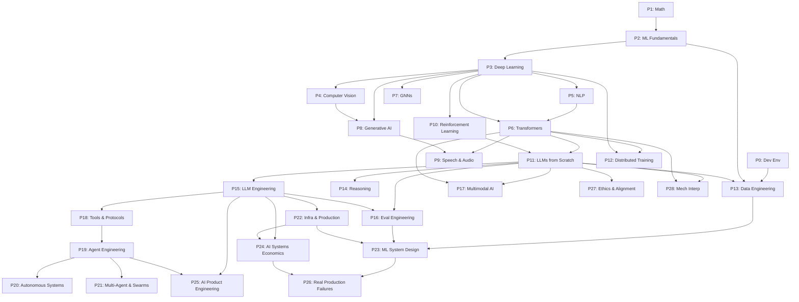

# 🧠 Complete AI/ML/DL Learning Roadmap
## Zero → Professional AI Engineer
### The Most Comprehensive AI Learning Roadmap (2025-2026)

---

> **Language:** Python 🐍 Only  
> **Total Phases:** 30  
> **Total Lessons:** 594  
> **Goal:** Junior → Senior AI Engineer at FAANG / Anthropic / OpenAI  
> **Time Commitment:** ~2,900–3,900 hours (2–3 years full-time)  
> **Lesson Estimates:** (S) = <1 hr | (M) = 1-3 hrs | (L) = 3-8 hrs

---

### 🏁 Fast Start (Your First 40 Hours)
1. **Phase 0 (full)** — Set up your dev environment
2. **Phase 1, Lessons 1-4** — Linear algebra + calculus intuition
3. **Phase 2, Lessons 1-4** — Linear/logistic regression + decision trees
4. **Phase 3, Lessons 1-4** — Build a small neural net from scratch

At this point, you've built an MLP with backprop and you're ready for any track.

---

## 🏔️ Milestone Compression
These milestones represent your identity transitions throughout the roadmap. Use these as your primary psychological checkpoints.

| Milestone | Outcome | Achieved After |
|-----------|---------|----------------|
| **Milestone 1** | Classical ML Engineer | Phase 2 |
| **Milestone 2** | Deep Learning Engineer | Phase 5 |
| **Milestone 3** | LLM Engineer | Phase 15 |
| **Milestone 4** | AI Systems Engineer | Phase 23 |
| **Milestone 5** | Agentic AI Engineer | Phase 21 |
| **Milestone 6** | AI Research Scientist | Phase 29 |

---

## 🗺️ Learning Tracks & Dependency Graph
To help you navigate this comprehensive roadmap, here are the phase dependencies and suggested tracks based on your career goals.

### Minimum Viable Tracks
- **Research Scientist (Anthropic/OpenAI):** Phases 1, 3, 6, 10, 11, 14, 27, 28
- **LLM Platform Engineer:** Phases 0, 3, 6, 13, 15, 16, 18, 22, 23, 24, 25
- **FAANG ML Engineer:** Phases 0, 2, 3, 6, 7, 11, 13, 15, 16, 22, 23, 24, 26
- **Eval / Safety Engineer:** Phases 0, 2, 6, 11, 15, 16, 26, 27, 28

### Phase Dependencies
| Phase | Prerequisites | Description |
|-------|---------------|-------------|
| 0 to 5 | Sequential | Foundation (Math, ML, DL, CV, NLP) |
| 6. Transformers | Phase 3, 5 | Core architecture for modern AI |
| 7. Graph Neural Networks | Phase 3, 1.21 | Relational & structured data |
| 8. Generative AI | Phase 3, 4 | VAEs, GANs, Diffusion |
| 9. Speech & Audio | Phase 6, 8 | Transformers + diffusion for audio |
| 10. Reinforcement Learning | Phase 3 | Core RL concepts |
| 11. LLMs from Scratch | Phase 6, 10 | Building and aligning LLMs |
| 12. Distributed Training | Phase 3, 6 | Training models too large to fit on one GPU |
| 13. Data Engineering | Phase 0, 2, 11.03 | The 40–60% of real ML work |
| 14. Reasoning & Test-Time | Phase 11 | Scaling inference compute |
| 15. LLM Engineering | Phase 11 | Applying LLMs in production |
| 16. Eval Engineering | Phase 11, 15 | The full eval discipline |
| 17. Multimodal AI | Phase 6, 11 | Vision-Language Models, etc. |
| 18. Tools & Protocols | Phase 15 | Function calling, MCP |
| 19. Agent Engineering | Phase 18 | Building tool-using agents |
| 20. Autonomous Systems | Phase 19 | Long-horizon agents |
| 21. Multi-Agent & Swarms | Phase 19 | Coordinating multiple agents |
| 22. Infra & Production | Phase 15 | Serving, CUDA, scaling |
| 23. ML System Design | Phase 2, 6, 7, 13, 15, 16, 22 | FAANG interview & production |
| 24. Ethics & Alignment | Phase 11 | Safety, alignment, fairness |
| 25. Mech Interpretability | Phase 6, 11 | SAEs, circuits, patching, steering |

### Visual Dependency Graph

---

## 📋 Table of Contents

| Phase | Name | Lessons |
|-------|------|---------|
| [Phase 0](#phase-0--dev-environment--tooling) | Dev Environment & Tooling | 12 |
| [Phase 1](#phase-1--math-foundations) | Math Foundations | 22 |
| [Phase 2](#phase-2--ml-fundamentals) | ML Fundamentals | 20 |
| [Phase 3](#phase-3--deep-learning-core) | Deep Learning Core | 21 |
| [Phase 4](#phase-4--computer-vision) | Computer Vision | 28 |
| [Phase 5](#phase-5--nlp-foundations-to-advanced) | NLP: Foundations to Advanced | 29 |
| [Phase 6](#phase-6--transformers-deep-dive) | Transformers Deep Dive | 14 |
| [Phase 7](#phase-7--graph-neural-networks) | Graph Neural Networks | 8 |
| [Phase 8](#phase-8--generative-ai) | Generative AI | 14 |
| [Phase 9](#phase-9--speech--audio) | Speech & Audio | 17 |
| [Phase 10](#phase-10--reinforcement-learning) | Reinforcement Learning | 16 |
| [Phase 11](#phase-11--llms-from-scratch) | LLMs from Scratch | 27 |
| [Phase 12](#phase-12--distributed-training-deep-dive) | Distributed Training Deep Dive | 5 |
| [Phase 13](#phase-13--data-engineering-for-ai) | Data Engineering for AI | 19 |
| [Phase 14](#phase-14--reasoning--test-time-compute) | Reasoning & Test-Time Compute | 18 |
| [Phase 15](#phase-15--llm-engineering) | LLM Engineering | 20 |
| [Phase 16](#phase-16--eval-engineering) | Eval Engineering | 12 |
| [Phase 17](#phase-17--multimodal-ai) | Multimodal AI | 29 |
| [Phase 18](#phase-18--tools--protocols) | Tools & Protocols | 23 |
| [Phase 19](#phase-19--agent-engineering) | Agent Engineering | 31 |
| [Phase 20](#phase-20--autonomous-systems) | Autonomous Systems | 29 |
| [Phase 21](#phase-21--multi-agent--swarms) | Multi-Agent & Swarms | 25 |
| [Phase 22](#phase-22--infrastructure--production) | Infrastructure & Production | 55 |
| [Phase 23](#phase-23--ml-system-design) | ML System Design | 17 |
| [Phase 24](#phase-24--ai-systems-economics) | AI Systems Economics | 10 |
| [Phase 25](#phase-25--ai-product-engineering--human-factors) | AI Product Engineering & Human Factors | 10 |
| [Phase 26](#phase-26--real-production-failures--postmortems) | Real Production Failures & Postmortems | 12 |
| [Phase 27](#phase-27--ethics-safety--alignment) | Ethics, Safety & Alignment | 32 |
| [Phase 28](#phase-28--mechanistic-interpretability) | Mechanistic Interpretability | 16 |
| [Phase 29](#phase-29--capstone-projects) | Capstone Projects | 20 |
| **TOTAL** | | **594** |

---

## Phase 0 — Dev Environment & Tooling
> 🛠️ 12 Lessons · Get your environment ready for everything that follows

| # | Lesson | Type | What's Inside |
|---|--------|------|---------------|
| 01 | Dev Environment | Build 🐍 (M) | Installing Python, package managers (pip), PATH setup, VS Code/Cursor/PyCharm — your entire local setup from zero |
| 02 | Git & Collaboration | Learn (S) | git init/add/commit/push/pull, branching strategies, pull requests, merge conflicts, code review — how teams actually work |
| 03 | GPU Setup & Cloud | Build 🐍 (M) | CUDA, cuDNN, checking GPU availability in PyTorch, Google Colab Pro, Kaggle kernels, Lambda Labs, RunPod |
| 04 | APIs & Keys | Build 🐍 (S) | OpenAI/Anthropic/Gemini API setup, environment variables, .env files, never hardcoding secrets, rate limits, API cost tracking |
| 05 | Jupyter Notebooks | Build 🐍 (S) | Jupyter Lab, magic commands (%timeit, %%capture), nbconvert, notebook best practices, why notebooks are dangerous in production |
| 06 | Python Environments | Build 🐍 (S) | venv, conda, pyenv, uv (the new fast standard), requirements.txt, pyproject.toml, dependency hell and how to avoid it |
| 07 | Docker for AI | Build 🐍 (M) | What Docker solves, images vs containers, Dockerfile, docker-compose, building ML images, NVIDIA Container Toolkit |
| 08 | Editor Setup | Build 🐍 (S) | VS Code extensions for ML/AI (Python, Pylance, Jupyter, GitLens, GitHub Copilot), Cursor AI editor, keybindings |
| 09 | Data Management | Build 🐍 (M) | DVC (Data Version Control), large file handling, .gitignore for datasets, cloud storage (S3/GCS buckets), data lineage |
| 10 | Terminal & Shell | Learn (S) | bash vs zsh, shell navigation (cd/ls/grep/find/awk/sed), piping, redirects, aliases, .bashrc/.zshrc |
| 11 | Linux for AI | Learn (M) | File permissions (chmod/chown), process management (ps/kill/htop), screen/tmux for long training runs, SSH, cron jobs |
| 12 | Debugging & Profiling | Build 🐍 (L) | pdb/ipdb debugger, Python profilers (cProfile, line_profiler), memory profiling (memory_profiler), PyTorch profiler |

---

## Phase 1 — Math Foundations
> 🟣 22 Lessons · The intuition behind every AI algorithm, through code

| # | Lesson | Type | What's Inside |
|---|--------|------|---------------|
| 01 | Linear Algebra Intuition | Learn 🐍 (M) | What vectors and matrices mean geometrically, why linear algebra is the language data lives in, visual intuition first |
| 02 | Vectors, Matrices & Operations | Build 🐍 (M) | Vector addition/scaling/dot product, matrix multiplication, transpose, inverse, determinant — implemented in NumPy |
| 03 | Matrix Transformations & Eigenvalues | Build 🐍 (L) | Eigenvalues/eigenvectors geometric meaning, SVD derivation, PCA from first principles mathematically |
| 04 | Calculus for ML: Derivatives & Gradients | Learn 🐍 (M) | Limits → derivatives (power/chain/product/quotient rules), partial derivatives, gradients as direction of steepest ascent |
| 05 | Chain Rule & Automatic Differentiation | Build 🐍 (L) | Multivariable chain rule, computation graphs, forward-mode vs reverse-mode autodiff, building a tiny autograd engine |
| 06 | Probability & Distributions | Learn 🐍 (M) | Sample spaces, probability rules, conditional probability, Bernoulli, Binomial, Gaussian, Poisson, Beta, Dirichlet |
| 07 | Bayes Theorem & Statistical Thinking | Build 🐍 (M) | Bayes theorem derivation, prior/likelihood/posterior, MLE vs MAP, CLT, hypothesis testing, p-values, confidence intervals |
| 08 | Optimization: Gradient Descent Family | Build 🐍 (L) | Convexity, gradient descent from scratch, SGD, Mini-Batch GD, Momentum, NAG, AdaGrad, RMSProp, Adam, AdamW |
| 09 | Information Theory: Entropy & KL Divergence | Learn 🐍 (M) | Shannon entropy, cross-entropy, KL divergence, mutual information, Jensen-Shannon divergence, perplexity |
| 10 | Dimensionality Reduction: PCA, t-SNE, UMAP | Build 🐍 (M) | PCA (geometric intuition → math → code), t-SNE (neighbor preservation), UMAP (topology-based), when to use which |
| 11 | Singular Value Decomposition (SVD) | Build 🐍 (M) | SVD decomposition (A = UΣVᵀ), geometric interpretation, truncated SVD, SVD for image compression |
| 12 | Tensor Operations | Build 🐍 (S) | What tensors are, tensor shapes, reshaping, broadcasting rules, Einstein summation (einsum), batched operations |
| 13 | Numerical Stability | Build 🐍 (M) | Floating point arithmetic, overflow/underflow, log-sum-exp trick, numerically stable softmax |
| 14 | Norms & Distances | Build 🐍 (S) | L1/L2/Lp/Frobenius norms, cosine similarity, Euclidean/Manhattan/Chebyshev/Mahalanobis distance |
| 15 | Statistics for ML | Build 🐍 (M) | Mean/variance/covariance/correlation, t-tests, chi-square, ANOVA, effect size, statistical significance |
| 16 | Sampling Methods | Build 🐍 (M) | Monte Carlo sampling, importance sampling, rejection sampling, MCMC, Gibbs sampling |
| 17 | Linear Systems | Build 🐍 (M) | Solving Ax=b (Gaussian elimination, LU decomposition), least squares (OLS derivation), pseudoinverse |
| 18 | Convex Optimization | Build 🐍 (L) | Convex sets and functions, Lagrange multipliers, KKT conditions (used in SVMs), duality, constrained optimization |
| 19 | Complex Numbers for AI | Learn 🐍 (M) | Complex number arithmetic, Euler's formula, why this matters for Fourier transforms and RoPE positional encodings |
| 20 | The Fourier Transform | Build 🐍 (L) | DFT/FFT intuition, why it matters for audio AI, spectrograms, positional encodings, convolution theorem |
| 21 | Graph Theory for ML | Build 🐍 (M) | Graphs (nodes/edges/adjacency matrices), graph traversal, PageRank, GNN preview, knowledge graphs |
| 22 | Stochastic Processes | Learn 🐍 (M) | Random walks, Markov chains, MDP preview for RL, Brownian motion — math behind diffusion models and RL |

---

## Phase 2 — ML Fundamentals
> 🔵 20 Lessons · Classical ML — still the backbone of most production AI

| # | Lesson | Type | What's Inside |
|---|--------|------|---------------|
| 01 | What Is Machine Learning | Learn 🐍 (S) | Supervised/unsupervised/semi-supervised/self-supervised, batch vs online, instance-based vs model-based, ML pipeline |
| 02 | Linear Regression from Scratch | Build 🐍 (M) | Simple & multiple linear regression, OLS derivation, MLE interpretation, regression metrics (MSE/MAE/RMSE/R²), gradient descent |
| 03 | Logistic Regression & Classification | Build 🐍 (M) | Sigmoid function, binary cross-entropy, MLE derivation, gradient descent from scratch, softmax for multiclass, classification metrics |
| 04 | Decision Trees & Random Forests | Build 🐍 (L) | Decision trees (entropy, Gini impurity, information gain), Random Forest (bagging, feature importance, OOB score, bias-variance) |
| 05 | Support Vector Machines | Build 🐍 (M) | Geometric intuition, hard-margin SVM (full math), soft-margin SVM, kernel trick (RBF, polynomial) |
| 06 | KNN & Distance Metrics | Build 🐍 (M) | K-Nearest Neighbors (intuition, distance metrics, choosing K, curse of dimensionality), KNN from scratch |
| 07 | Unsupervised Learning: K-Means, DBSCAN | Build 🐍 (M) | K-Means (K-Means++ initialization, elbow method, silhouette score, from scratch), hierarchical clustering, DBSCAN |
| 08 | Feature Engineering & Selection | Build 🐍 (M) | EDA, feature scaling, encoding (ordinal/label/one-hot/target), transforms, binning, date/time features, ML Pipelines |
| 09 | Model Evaluation: Metrics, Cross-Validation | Build 🐍 (M) | Cross-validation (k-fold, stratified), precision/recall/F1/AUC-ROC, calibration, A/B testing, leakage prevention |
| 10 | Bias, Variance & the Learning Curve | Learn 🐍 (S) | Bias-variance tradeoff, underfitting vs overfitting, learning curves, validation curves, VC dimension |
| 11 | Ensemble Methods: Boosting, Bagging, Stacking | Build 🐍 (L) | Voting, Bagging, AdaBoost (step-by-step math), Gradient Boosting (math), XGBoost (full math), LightGBM, Stacking & Blending |
| 12 | Hyperparameter Tuning | Build 🐍 (M) | GridSearchCV, RandomizedSearchCV, Bayesian Optimization (Optuna), Keras Tuner |
| 13 | ML Pipelines & Experiment Tracking | Build 🐍 (L) | Scikit-learn Pipelines, MLflow, Weights & Biases (W&B), experiment tracking, model registry, reproducibility |
| 14 | Naive Bayes | Build 🐍 (M) | Conditional probability → Bayes theorem → Gaussian/Multinomial/Bernoulli NB, Laplace smoothing |
| 15 | Time Series Fundamentals | Build 🐍 (L) | Stationarity, ACF/PACF, ARIMA, seasonal decomposition, feature engineering for time series, forecasting evaluation |
| 16 | Anomaly Detection | Build 🐍 (M) | Statistical methods (Z-score, IQR, Winsorization), Isolation Forest, One-Class SVM, Local Outlier Factor |
| 17 | Handling Imbalanced Data | Build 🐍 (M) | Class imbalance, undersampling, oversampling, SMOTE, class weights |
| 18 | Feature Selection | Build 🐍 (S) | Filter/wrapper/embedded methods, PCA for selection, handling missing data (SimpleImputer, KNN Imputer, MICE) |
| 19 | Data-Centric AI I: Data Quality | Learn 🐍 (M) | Importance of data quality over model tweaking, handling noisy labels, data cleaning pipelines, outlier handling |
| 20 | Data-Centric AI II: Annotation & Active Learning | Build 🐍 (L) | Labeling pipelines, annotation tools (Label Studio), active learning loop, uncertainty sampling |

---

## Phase 3 — Deep Learning Core
> 🟢 21 Lessons · Neural networks from first principles — no frameworks until you build one

| # | Lesson | Type | What's Inside |
|---|--------|------|---------------|
| 01 | The Perceptron: Where It All Started | Build 🐍 (M) | Biological neuron vs mathematical perceptron, geometric intuition, perceptron trick, hinge loss, binary cross-entropy |
| 02 | Multi-Layer Networks & Forward Pass | Build 🐍 (M) | MLP notation, why we need multiple layers (XOR problem), forward propagation, universal approximation theorem, NumPy MLP |
| 03 | Backpropagation from Scratch | Build 🐍 (L) | Chain rule through computation graphs, backprop (The What/How/Why), MLP memoization, gradient flow visualization |
| 04 | Activation Functions: ReLU, Sigmoid, GELU | Build 🐍 (S) | Sigmoid, Tanh, ReLU, Leaky ReLU, Parametric ReLU, ELU, SELU, GELU, Swish — when to use what and why |
| 05 | Loss Functions: MSE, Cross-Entropy | Build 🐍 (M) | MSE, MAE, Huber loss, binary/categorical cross-entropy, focal loss, contrastive loss, triplet loss |
| 06 | Optimizers: SGD, Momentum, Adam, AdamW | Build 🐍 (L) | Batch/SGD/Mini-batch GD, exponentially weighted moving averages, SGD Momentum, NAG, AdaGrad, RMSProp, Adam, AdamW |
| 07 | Regularization: Dropout, Weight Decay | Build 🐍 (M) | L1/L2 regularization, dropout, early stopping, Batch Normalization, Layer Normalization |
| 08 | Weight Initialization & Training Stability | Build 🐍 (M) | Why initialization matters, vanishing/exploding gradients, Xavier/Glorot initialization, He initialization, gradient clipping |
| 09 | Learning Rate Schedules & Warmup | Build 🐍 (S) | Step decay, cosine annealing, warmup, cyclical learning rates, learning rate finder |
| 10 | Build Your Own Mini Framework | Build 🐍 (L) | Complete mini deep learning framework — Tensor class, autograd, optimizers, layers (like simplified PyTorch) |
| 11 | Introduction to PyTorch | Build 🐍 (L) | Tensors, autograd, nn.Module, DataLoader, training loop, saving/loading models, GPU usage |
| 12 | Introduction to JAX | Build 🐍 (M) | What JAX is, jit/vmap/grad/pmap, Flax/Haiku basics — used at Google DeepMind and top research labs |
| 13 | Debugging Neural Networks | Build 🐍 (M) | Systematic debugging (overfit one batch first), gradient checking, loss curves diagnosis, common failure modes |
| 14 | Safety Checkpoint: Representational Harms | Learn 🐍 (S) | Unintended biases in simple MLPs, data bias reflecting in weights, introduction to fairness |
| 15 | Bayesian Neural Networks (BNNs) | Build 🐍 (L) | Weight uncertainty, priors over weights, replacing point estimates with distributions (Bayes by Backprop) |
| 16 | Variational Inference & ELBO | Build 🐍 (M) | Kullback-Leibler (KL) divergence, Evidence Lower Bound (ELBO), mean-field approximation for BNNs |
| 17 | MC Dropout for Epistemic Uncertainty | Build 🐍 (M) | Monte Carlo Dropout as a Bayesian approximation, epistemic (model) vs aleatoric (data) uncertainty |
| 18 | Evidential Deep Learning | Build 🐍 (M) | Learning uncertainty without sampling, Dirichlet distributions for classification confidence, Out-of-Distribution (OOD) detection |
| 19 | Conformal Prediction Basics | Build 🐍 (M) | Distribution-free uncertainty quantification, coverage guarantees, calibration vs non-conformity scores |
| 20 | Conformal Classification & Regression | Build 🐍 (L) | Generating prediction sets (classification) and prediction intervals (regression) with valid marginal coverage |
| 21 | Phase 3 Synthesis Project | Build 🐍 (L) | End-to-end multi-layer network with PyTorch, calibrated with MC Dropout and Conformal Prediction |

---

## Phase 4 — Computer Vision
> 🟠 28 Lessons · From pixels to understanding — image, video, 3D, VLMs, and world models

| # | Lesson | Type | What's Inside |
|---|--------|------|---------------|
| 01 | Image Fundamentals: Pixels, Channels | Learn 🐍 (S) | What a pixel is, RGB/BGR/HSV/grayscale, image arrays in NumPy, OpenCV basics, image histograms |
| 02 | Convolutions from Scratch | Build 🐍 (M) | Edge detection (Sobel, Canny), convolution operation math, padding & strides (formulas), convolution on RGB images |
| 03 | CNNs: LeNet to ResNet | Build 🐍 (L) | LeNet-5, AlexNet, VGG16, ResNet (residual connections — why they work, from scratch), EfficientNet |
| 04 | Image Classification | Build 🐍 (M) | Full CNN pipeline from scratch, callbacks, pooling layers, backpropagation in CNNs, Cat vs Dog project, MNIST |
| 05 | Transfer Learning & Fine-Tuning | Build 🐍 (M) | Feature extraction vs full fine-tuning, ImageNet/ILSVRC, pretrained model zoo, visualizing CNN filters, Keras Functional API |
| 06 | Object Detection — YOLO from Scratch | Build 🐍 (L) | R-CNN → Fast R-CNN (NMS) → Faster R-CNN → YOLO (architecture, YOLOv11 custom training, cloud deployment) |
| 07 | Semantic Segmentation — U-Net | Build 🐍 (L) | Pixel-wise classification, U-Net architecture (encoder-decoder + skip connections), coding U-Net from scratch |
| 08 | Instance Segmentation — Mask R-CNN | Build 🐍 (M) | Difference between semantic and instance segmentation, Mask R-CNN architecture, RoI Align |
| 09 | Image Generation — GANs | Build 🐍 (L) | Minimax game, GAN training from scratch, DCGAN, training instability, mode collapse, conditional GANs, StyleGAN |
| 10 | Image Generation — Diffusion Models | Build 🐍 (L) | Forward (noise) process, reverse (denoise) process, DDPM math from scratch, score matching, DDIM |
| 11 | Stable Diffusion — Architecture & Fine-Tuning | Build 🐍 (L) | Latent Diffusion Models, VAE as compressor, U-Net denoiser, CLIP text conditioning, classifier-free guidance, ControlNet, LoRA |
| 12 | Video Understanding — Temporal Modeling | Build 🐍 (M) | Video as 3D tensors, optical flow, 3D convolutions, temporal attention, video classification, action recognition |
| 13 | 3D Vision: Point Clouds, NeRFs | Build 🐍 (M) | Point cloud representation, PointNet, Neural Radiance Fields (NeRF), depth estimation |
| 14 | Vision Transformers (ViT) | Build 🐍 (M) | Patch tokenization, class token, positional embeddings, ViT architecture — attention applied to images |
| 15 | Real-Time Vision: Edge Deployment | Build 🐍 (M) | ONNX export, TensorRT, quantization for edge, mobile deployment |
| 16 | Build a Complete Vision Pipeline | Build 🐍 (L) | End-to-end: data ingestion → preprocessing → training → evaluation → serving — production-grade CV pipeline |
| 17 | Self-Supervised Vision — SimCLR, DINO, MAE | Build 🐍 (M) | Contrastive learning (SimCLR), DINO (self-distillation), Masked Autoencoders (MAE) — learning without labels |
| 18 | Open-Vocabulary Vision — CLIP | Build 🐍 (L) | Contrastive image-text pretraining, zero-shot classification, CLIP embeddings for retrieval |
| 19 | OCR & Document Understanding | Build 🐍 (M) | Text detection, text recognition, Tesseract, PaddleOCR, document layout analysis |
| 20 | Image Retrieval & Metric Learning | Build 🐍 (M) | Embedding images into metric spaces, triplet loss, contrastive loss, ArcFace, FAISS for image search |
| 21 | Keypoint Detection & Pose Estimation | Build 🐍 (M) | Human pose estimation, skeleton detection, heatmap-based detection, MediaPipe |
| 22 | 3D Gaussian Splatting from Scratch | Build 🐍 (L) | 3D-GS as alternative to NeRF, Gaussian primitives, rasterization, real-time rendering |
| 23 | Diffusion Transformers & Rectified Flow | Build 🐍 (M) | DiT (Diffusion Transformer), Rectified Flow (flow matching), used in Sora and Stable Diffusion 3 |
| 24 | SAM 3 & Open-Vocabulary Segmentation | Build 🐍 (M) | Segment Anything Model (SAM) architecture, prompt-based segmentation, zero-shot segmentation |
| 25 | Vision-Language Models (ViT-MLP-LLM) | Build 🐍 (M) | Standard VLM architecture (visual encoder + projector MLP + language decoder), LLaVA architecture |
| 26 | Monocular Depth & Geometry Estimation | Build 🐍 (M) | Estimating depth from a single image, Depth Anything, geometric understanding |
| 27 | Multi-Object Tracking & Video Memory | Build 🐍 (M) | SORT, DeepSORT, ByteTrack, tracking by detection, re-identification, video memory |
| 28 | World Models & Video Diffusion | Build 🐍 (M) | What a world model is, video diffusion (Sora, CogVideoX), GAIA, applications in autonomous driving |

---

## Phase 5 — NLP: Foundations to Advanced
> 🔴 29 Lessons · Language is the interface to intelligence

| # | Lesson | Type | What's Inside |
|---|--------|------|---------------|
| 01 | Text Processing: Tokenization, Stemming | Build 🐍 (M) | NLP pipeline intro, text preprocessing, tokenization (word/sentence/character), stemming, lemmatization, stop words, regex |
| 02 | Bag of Words, TF-IDF & Text Representation | Build 🐍 (S) | BoW, N-grams/Bi-grams/Uni-grams, TF-IDF, sparsity problem — classical text features |
| 03 | Word Embeddings: Word2Vec from Scratch | Build 🐍 (L) | Why BoW fails, Word2Vec (CBOW + Skip-gram from scratch), negative sampling, Game of Thrones Word2Vec project |
| 04 | GloVe, FastText & Subword Embeddings | Build 🐍 (M) | GloVe (global co-occurrence matrix), FastText (character n-grams for OOV words), Average Word2Vec |
| 05 | Sentiment Analysis | Build 🐍 (L) | Rule-based (VADER), ML-based (logistic regression on TF-IDF), DL-based (RNN/LSTM sentiment) — full pipeline comparison |
| 06 | Named Entity Recognition (NER) | Build 🐍 (M) | Sequence labeling, BIO tagging scheme, CRF, spaCy NER, fine-tuning BERT for NER |
| 07 | POS Tagging & Syntactic Parsing | Build 🐍 (M) | Part-of-Speech tagging, Hidden Markov Models (HMM), Viterbi algorithm (full derivation), dependency parsing |
| 08 | Text Classification — CNNs & RNNs for Text | Build 🐍 (L) | CNNs for text (n-gram features), RNN for sentiment, types of RNN, Quora Duplicate Question Pairs project |
| 09 | Sequence-to-Sequence Models | Build 🐍 (L) | Encoder-Decoder architecture (seq2seq), teacher forcing, beam search decoding, BLEU score evaluation |
| 10 | Attention Mechanism — The Breakthrough | Build 🐍 (M) | Bahdanau attention (additive, step-by-step), Luong attention (multiplicative), solving the information bottleneck |
| 11 | Machine Translation | Build 🐍 (L) | Full NMT pipeline, evaluation (BLEU, chrF, COMET), multilingual models, low-resource translation |
| 12 | Text Summarization | Build 🐍 (M) | Extractive (TextRank) vs abstractive (seq2seq, BART, T5) summarization, ROUGE evaluation |
| 13 | Question Answering Systems | Build 🐍 (M) | Extractive QA (finding answer span), SQuAD dataset, BERT for QA, generative QA |
| 14 | Information Retrieval & Search | Build 🐍 (M) | TF-IDF retrieval, BM25 (gold standard for sparse retrieval), dense retrieval (DPR), bi-encoders vs cross-encoders |
| 15 | Topic Modeling: LDA, BERTopic | Build 🐍 (M) | Latent Dirichlet Allocation (LDA math), BERTopic (clustering embeddings), discovering themes in large corpora |
| 16 | Text Generation | Build 🐍 (M) | Language modeling, temperature, top-k sampling, nucleus (top-p) sampling, greedy vs beam search vs sampling |
| 17 | Chatbots: Rule-Based to Neural | Build 🐍 (M) | Rule-based chatbots, retrieval-based chatbots, generative chatbots, state management |
| 18 | Multilingual NLP | Build 🐍 (S) | Multilingual BERT (mBERT), XLM-R, zero-shot cross-lingual transfer, challenges of multilingual models |
| 19 | Subword Tokenization: BPE, WordPiece | Learn 🐍 (S) | Why subword tokenization exists, BPE (step by step), WordPiece (BERT tokenizer), Unigram LM, SentencePiece |
| 20 | Structured Outputs & Constrained Decoding | Build 🐍 (M) | JSON mode, grammar-constrained generation, Guidance/Outlines library, why structured outputs matter in production |
| 21 | NLI & Textual Entailment | Learn 🐍 (M) | Natural Language Inference (entailment/contradiction/neutral), SNLI/MultiNLI datasets, zero-shot classification via NLI |
| 22 | Embedding Models Deep Dive | Learn 🐍 (S) | Sentence-BERT (SBERT), E5, BGE, GTE, OpenAI embeddings, MTEB benchmark — choosing the right embedding model |
| 23 | Chunking Strategies for RAG | Build 🐍 (L) | Fixed-size chunking, recursive character splitting, semantic chunking, markdown-aware, code-aware splitting |
| 24 | Coreference Resolution | Learn 🐍 (S) | Pronoun resolution, why this matters for document understanding |
| 25 | Entity Linking & Disambiguation | Build 🐍 (M) | Linking mentions to knowledge base entities (Wikipedia/Wikidata), disambiguation |
| 26 | Relation Extraction & Knowledge Graphs | Build 🐍 (L) | Extracting (subject, relation, object) triples from text, building knowledge graphs, Graph RAG foundation |
| 27 | LLM Evaluation: RAGAS, DeepEval, G-Eval | Build 🐍 (L) | RAGAS (faithfulness/answer relevancy/context precision/recall), DeepEval framework, G-Eval (LLM-as-judge) |
| 28 | Long-Context Evaluation: NIAH, RULER | Learn 🐍 (S) | Needle-in-a-Haystack (NIAH) test, RULER benchmark, LongBench, MRCR — evaluating models at 100K+ token contexts |
| 29 | Dialogue State Tracking | Build 🐍 (M) | Tracking conversation state across turns, slot filling, dialogue acts, building a stateful conversational system |

---

## Phase 6 — Transformers Deep Dive
> 🟣 14 Lessons · The architecture that changed everything

| # | Lesson | Type | What's Inside |
|---|--------|------|---------------|
| 01 | Why Transformers: The Problems with RNNs | Learn 🐍 (S) | Epic history of LLMs (LSTMs to ChatGPT), vanishing gradient in RNNs, BPTT, sequential computation bottleneck |
| 02 | Self-Attention from Scratch | Build 🐍 (L) | Q/K/V matrices derivation, why we need Query/Key/Value, self-attention score computation, geometric intuition, code |
| 03 | Multi-Head Attention | Build 🐍 (M) | Why multiple attention heads, concatenation + projection, multi-head vs single-head comparison |
| 04 | Positional Encoding: Sinusoidal, RoPE, ALiBi | Build 🐍 (L) | Why Transformers have no inherent position sense, sinusoidal PE (original paper), RoPE (LLaMA), ALiBi |
| 05 | The Full Transformer: Encoder + Decoder | Build 🐍 (M) | Encoder architecture, masked self-attention in decoder, cross-attention, full Transformer architecture |
| 06 | BERT — Masked Language Modeling | Build 🐍 (M) | BERT architecture (encoder-only), MLM, NSP, [CLS] token for classification, fine-tuning BERT |
| 07 | GPT — Causal Language Modeling | Build 🐍 (L) | GPT architecture (decoder-only), causal masking, autoregressive generation, GPT-1 → GPT-2 → GPT-3 → GPT-4 |
| 08 | T5, BART — Encoder-Decoder Models | Learn 🐍 (M) | T5 (text-to-text framework), BART (denoising pretraining), when to use encoder-only vs decoder-only vs encoder-decoder |
| 09 | Vision Transformers (ViT) | Build 🐍 (M) | Applying Transformers to images (patch tokenization), ViT architecture, DeiT, Swin Transformer |
| 10 | Audio Transformers — Whisper Architecture | Learn 🐍 (S) | How Whisper uses encoder-decoder Transformer on spectrogram patches, multitask tokens, timestamp prediction |
| 11 | Mixture of Experts (MoE) | Build 🐍 (M) | What MoE is (sparse activation), gating mechanism, load balancing loss, MoE in Mixtral/GPT-4/DeepSeek |
| 12 | KV Cache, Flash Attention & Inference | Build 🐍 (L) | KV cache, Flash Attention (IO-aware algorithm), Flash Attention 2&3, multi-query attention (MQA), grouped-query attention (GQA) |
| 13 | Scaling Laws | Learn 🐍 (M) | Kaplan et al. scaling laws, Chinchilla optimal compute, emergent abilities, what scaling laws tell us about future AI |
| 14 | Build a Transformer from Scratch | Build 🐍 (L) | Complete, training-ready Transformer in PyTorch (similar to Karpathy's nanoGPT) |

---

## Phase 7 — Graph Neural Networks
> 🕸️ 8 Lessons · The architecture for relational and structured data

**Prerequisites:** Phase 3 (Deep Learning Core), Phase 1 Lesson 21 (Graph Theory for ML)

| # | Lesson | Type | What's Inside |
|---|--------|------|---------------|
| 01 | Graphs in ML — Why Structure Matters | Learn 🐍 (S) | Why standard neural networks fail on graph-structured data, permutation invariance, graph representation (adjacency matrix, edge list), node/edge/graph-level tasks, real-world graph datasets (Cora, PPI, OGB) |
| 02 | Message Passing Neural Networks (MPNN) | Build 🐍 (L) | The message passing framework (aggregate → update), GCN (Graph Convolutional Network) from scratch, spectral vs spatial convolutions, Kipf & Welling GCN derivation, over-smoothing problem |
| 03 | GraphSAGE & Scalable GNNs | Build 🐍 (L) | GraphSAGE (sampling + aggregating neighbors), mini-batch training on large graphs, neighbor sampling strategies, scaling GNNs to million-node graphs (PinSage at Pinterest) |
| 04 | Graph Attention Networks (GAT) | Build 🐍 (M) | Attention over neighbors (learned edge weights), multi-head graph attention, GAT vs GCN comparison, GATv2 (dynamic attention), when attention helps on graphs |
| 05 | Heterogeneous Graphs & Relational GNNs | Build 🐍 (M) | Multiple node/edge types (users + items + reviews), R-GCN (Relational GCN), HGT (Heterogeneous Graph Transformer), knowledge graph embedding (TransE, RotatE, ComplEx) |
| 06 | Graph Transformers | Build 🐍 (L) | Applying Transformer attention to graphs (Graphormer, GPS), positional encodings for graphs (Laplacian PE, random walk PE), when graph Transformers beat message passing |
| 07 | Molecular GNNs & Science Applications | Build 🐍 (L) | GNNs for molecular property prediction (QM9, ZINC), SchNet (continuous filter convolution), DimeNet (directional message passing), protein structure (AlphaFold's graph reasoning), drug discovery pipelines |
| 08 | GNN Applications: Fraud, RecSys, KGs | Build 🐍 (M) | Fraud detection on transaction graphs (connecting to Phase 22), GNN-based recommendation (LightGCN), knowledge graph completion, link prediction, community detection — real production use cases |

---

## Phase 8 — Generative AI
> 💗 14 Lessons · Create images, video, audio, 3D, and more

| # | Lesson | Type | What's Inside |
|---|--------|------|---------------|
| 01 | Generative Models: Taxonomy & History | Learn 🐍 (S) | Landscape of generative models (explicit vs implicit density), VAEs, GANs, Normalizing Flows, Diffusion, Autoregressive |
| 02 | Autoencoders & VAE | Build 🐍 (L) | Autoencoders (reconstruction loss, bottleneck), VAEs (reparameterization trick, ELBO derivation, KL term, latent space) |
| 03 | GANs: Generator vs Discriminator | Build 🐍 (L) | Minimax game, JS divergence connection, Wasserstein GAN (WGAN, gradient penalty), training instability, mode collapse |
| 04 | Conditional GANs & Pix2Pix | Build 🐍 (L) | Class-conditional generation (cGAN), image-to-image translation (Pix2Pix), paired training data, CycleGAN (unpaired) |
| 05 | StyleGAN | Build 🐍 (M) | StyleGAN architecture (mapping network, AdaIN, progressive growing), style mixing, GAN evaluation (FID, IS) |
| 06 | Diffusion Models — DDPM from Scratch | Build 🐍 (L) | Forward diffusion (adding Gaussian noise step by step), reverse diffusion (learning to denoise), DDPM loss derivation |
| 07 | Latent Diffusion & Stable Diffusion | Build 🐍 (L) | Why compress to latent space first, VAE as compressor, U-Net denoiser in latent space, Stable Diffusion full architecture |
| 08 | ControlNet, LoRA & Conditioning | Build 🐍 (M) | ControlNet (conditioning on edges/depth/pose), LoRA for diffusion fine-tuning, DreamBooth, textual inversion |
| 09 | Inpainting, Outpainting & Editing | Build 🐍 (M) | Masked image editing, DALL-E style inpainting, Prompt2Prompt, Instruct-Pix2Pix |
| 10 | Video Generation | Build 🐍 (L) | Temporal diffusion models, DiT for video, Sora architecture (spacetime patches), CogVideoX, Wan2.1 |
| 11 | Audio Generation | Build 🐍 (M) | AudioLDM (latent diffusion for audio), MusicGen (autoregressive), AudioCraft |
| 12 | 3D Generation | Build 🐍 (M) | Text-to-3D (DreamFusion, Zero-1-to-3), 3D Gaussian Splatting for generation |
| 13 | Flow Matching & Rectified Flows | Build 🐍 (L) | Flow matching (ODE-based generation), Rectified Flow (Stable Diffusion 3, FLUX) |
| 14 | Evaluation: FID, CLIP Score | Build 🐍 (S) | FID (Fréchet Inception Distance), CLIP Score (text-image alignment), IS (Inception Score), human evaluation |

---

## Phase 9 — Speech & Audio
> 🟢 17 Lessons · Hear, understand, speak

| # | Lesson | Type | What's Inside |
|---|--------|------|---------------|
| 01 | Audio Fundamentals: Waveforms, Sampling, FFT | Learn 🐍 (S) | What sound is (pressure waves), digital audio (sampling rate, bit depth), Nyquist theorem, Fast Fourier Transform (FFT) |
| 02 | Spectrograms, Mel Scale & Audio Features | Build 🐍 (M) | STFT, spectrograms, Mel scale, Mel spectrograms, MFCCs (Mel-Frequency Cepstral Coefficients) |
| 03 | Audio Classification | Build 🐍 (M) | Training CNNs on spectrograms, audio data augmentation (SpecAugment), ESC-50/AudioSet datasets |
| 04 | Speech Recognition (ASR) | Build 🐍 (L) | CTC (Connectionist Temporal Classification) loss, acoustic models, end-to-end ASR with deep speech architecture |
| 05 | Whisper: Architecture & Fine-Tuning | Build 🐍 (L) | OpenAI Whisper architecture (encoder-decoder Transformer on log-Mel spectrograms), multitask training, fine-tuning |
| 06 | Speaker Recognition & Verification | Build 🐍 (M) | Speaker embeddings (d-vectors, x-vectors), speaker verification, speaker identification, diarization |
| 07 | Text-to-Speech (TTS) | Build 🐍 (L) | Neural TTS pipeline (text → phonemes → spectrogram → waveform), Tacotron 2, FastSpeech 2, vocoders (HiFi-GAN) |
| 08 | Voice Cloning & Voice Conversion | Build 🐍 (M) | Zero-shot voice cloning (XTTS), voice conversion, ethical considerations |
| 09 | Music Generation | Build 🐍 (L) | MusicGen (Meta), AudioCraft, melody conditioning, music continuation |
| 10 | Audio-Language Models | Build 🐍 (M) | Models that understand both audio and text (Qwen-Audio, Gemini Audio), audio captioning, audio QA |
| 11 | Real-Time Audio Processing | Build 🐍 (M) | Streaming audio, ring buffers, low-latency inference |
| 12 | Build a Voice Assistant Pipeline | Build 🐍 (L) | Full pipeline: microphone → VAD → ASR (Whisper) → LLM → TTS → speaker — the voice AI product loop |
| 13 | Neural Audio Codecs — EnCodec, SNAC, Mimi | Learn 🐍 (M) | Compressing audio into discrete tokens (residual vector quantization), why this enables audio language models |
| 14 | Voice Activity Detection & Turn-Taking | Build 🐍 (M) | Detecting when someone is speaking (VAD), silence detection, endpointing, handling turn-taking |
| 15 | Streaming Speech-to-Speech — Moshi | Learn 🐍 (M) | Real-time duplex speech models, streaming architecture, latency constraints, Moshi (Kyutai) architecture |
| 16 | Voice Anti-Spoofing & Audio Watermarking | Build 🐍 (M) | Detecting synthetic/cloned voices, audio deepfake detection, SynthID for audio |
| 17 | Audio Evaluation — WER, MOS, MMAU | Learn 🐍 (S) | Word Error Rate (WER), Character Error Rate (CER), Mean Opinion Score (MOS), MMAU benchmark |

---

## Phase 10 — Reinforcement Learning
> 🟣 16 Lessons · The foundation of RLHF and game-playing AI

| # | Lesson | Type | What's Inside |
|---|--------|------|---------------|
| 01 | MDPs, States, Actions & Rewards | Learn 🐍 (M) | Markov Decision Processes, state/action/reward/transition/discount, return, Bellman equation, episodic vs continuing tasks |
| 02 | Dynamic Programming | Build 🐍 (L) | Policy evaluation, policy improvement, policy iteration, value iteration — solving MDPs when you know the environment |
| 03 | Monte Carlo Methods | Build 🐍 (M) | Learning from experience (no model needed), MC prediction, MC control, importance sampling |
| 04 | Q-Learning, SARSA | Build 🐍 (L) | Temporal Difference learning, Q-Learning, SARSA, exploration vs exploitation (ε-greedy, UCB, Thompson sampling) |
| 05 | Deep Q-Networks (DQN) | Build 🐍 (L) | DQN, experience replay, target network, Double DQN, Dueling DQN, Atari game playing |
| 06 | Policy Gradients — REINFORCE | Build 🐍 (L) | Policy gradient theorem (derivation), REINFORCE algorithm, baseline (variance reduction), advantage function |
| 07 | Actor-Critic — A2C, A3C | Build 🐍 (L) | Combining value-based and policy-based, A2C, asynchronous A3C, Generalized Advantage Estimation (GAE) |
| 08 | PPO | Build 🐍 (L) | Proximal Policy Optimization — clipped surrogate objective, why PPO is dominant, PPO for LLMs (RLHF connection) |
| 09 | Reward Modeling & RLHF | Build 🐍 (L) | InstructGPT pipeline, human preferences, training a reward model, PPO with reward model, DPO, Constitutional AI (RLAIF) |
| 10 | GRPO (Group Relative Policy Optimization) | Build 🐍 (L) | Group Relative Policy Optimization (DeepSeekMath), removing the critic model, advantages over PPO for reasoning tasks |
| 11 | Group-Based Policy Optimization | Build 🐍 (M) | Sampling multiple outputs, scoring with a reward model, applying policy updates based on relative group performance |
| 12 | Multi-Agent RL | Build 🐍 (M) | Cooperative vs competitive agents, MADDPG, QMIX, MAPPO, emergent behavior |
| 13 | Sim-to-Real Transfer | Build 🐍 (M) | Training in simulation, domain randomization, sim-to-real gap, applications in robotics |
| 14 | RL for Games | Build 🐍 (M) | AlphaGo/AlphaZero (MCTS + RL), self-play, OpenAI Five (DOTA), Libratus (poker) |
| 15 | RL → LLM Alignment Transition | Learn 🐍 (S) | Conceptual bridge: How standard RL concepts map directly to LLM alignment |
| 16 | Phase 10 Synthesis Project | Build 🐍 (L) | Train a custom RL agent (PPO or GRPO) to solve a text-based environment or simple reasoning task |

---

## Phase 11 — LLMs from Scratch
> 🟧 27 Lessons · Build, train, and understand large language models

| # | Lesson | Type | What's Inside |
|---|--------|------|---------------|
| 01 | Tokenizers: BPE, WordPiece, SentencePiece | Build 🐍 (M) | Why tokenization matters, BPE algorithm step-by-step, WordPiece, Unigram, SentencePiece — implement from scratch |
| 02 | Building a Tokenizer from Scratch | Build 🐍 (L) | Full BPE tokenizer: training vocabulary, encode/decode functions, special tokens, handling edge cases |
| 03 | Tokenizer Training on Raw Corpora | Build 🐍 (M) | Handling Unicode normalization (NFC vs NFD), byte-fallback strategies, vocabulary size experiments, tokenizer fertility, trailing whitespace bugs |
| 04 | Data Pipelines for Pre-Training | Build 🐍 (L) | Large-scale data collection (CommonCrawl, The Pile, FineWeb), deduplication, quality filtering, streaming datasets |
| 05 | Pre-Training a Mini GPT (124M) | Build 🐍 (L) | Training full GPT-2-sized model from scratch: architecture, data loading, training loop, checkpointing, evaluation |
| 06 | Distributed Training, FSDP, DeepSpeed | Build 🐍 (L) | Data parallelism (DDP), model parallelism, pipeline parallelism, FSDP, DeepSpeed ZeRO stages |
| 07 | Synthetic Data Generation Pipelines | Build 🐍 (L) | Self-play, rejection sampling, Alpaca/Magpie/WizardLM generation, Self-Instruct at scale |
| 08 | Instruction Tuning — SFT | Build 🐍 (L) | Supervised Fine-Tuning on instruction-following data (Alpaca format), FLAN, chat templates, system prompts |
| 09 | RLHF — Reward Model + PPO | Build 🐍 (L) | Full RLHF pipeline: preference data → reward model (Bradley-Terry) → PPO with reward model → alignment evaluation |
| 10 | DPO — Direct Preference Optimization | Build 🐍 (M) | DPO derivation (bypassing reward model), DPO vs PPO tradeoffs, IPO, KTO, SimPO — preference optimization landscape |
| 11 | Constitutional AI & Self-Improvement | Build 🐍 (L) | Constitutional AI (RLAIF), self-critique and revision, Anthropic's approach to alignment |
| 12 | Continual Learning & Catastrophic Forgetting | Build 🐍 (M) | Rehearsal mechanisms, Elastic Weight Consolidation (EWC), updating LLMs without destroying prior knowledge |
| 13 | Safety Checkpoint: Model Evals | Learn 🐍 (S) | Recognizing alignment drift, benchmarking safety vs capability tradeoffs during fine-tuning |
| 14 | Evaluation — Benchmarks, Evals | Build 🐍 (M) | MMLU, HumanEval, GSM8K, HellaSwag, BIG-bench, MT-Bench, Arena-Hard — measuring what actually matters |
| 15 | Quantization: INT8, GPTQ, AWQ, GGUF | Build 🐍 (M) | Why quantization, PTQ vs QAT, GPTQ, AWQ, GGUF (for llama.cpp), bitsandbytes |
| 16 | Inference Optimization | Build 🐍 (M) | KV cache management, continuous batching, PagedAttention (vLLM), speculative decoding, Flash Attention |
| 17 | Building a Complete LLM Pipeline | Build 🐍 (L) | End-to-end: pretrain → SFT → RLHF/DPO → evaluate → quantize → serve |
| 18 | Frontier Models: Architecture Walkthroughs | Learn 🐍 (M) | LLaMA 3 (GQA, RoPE, RMSNorm), Mistral/Mixtral (sliding window attention, MoE), Phi-3/4, Gemma 3, Gemini 2.5 Pro |
| 19 | Speculative Decoding, Medusa & EAGLE-3 | Build 🐍 (L) | Draft model + verification model (2-3x speedup), Medusa/Hydra (multiple decoding heads), EAGLE (tree-structured speculative decoding), EAGLE-3 |
| 20 | Differential Attention (V2) | Build 🐍 (M) | Differential Attention mechanism (cancelling attention noise), implementation, performance gains |
| 21 | Native Sparse Attention (DeepSeek NSA) | Build 🐍 (M) | DeepSeek's Native Sparse Attention, block-sparse patterns, hardware-efficient implementation for long contexts |
| 22 | Multi-Token Prediction (MTP) | Build 🐍 (L) | Predicting multiple future tokens simultaneously, training objective, inference-time use |
| 23 | DualPipe Parallelism | Learn 🐍 (M) | DeepSeek's DualPipe for pipeline parallelism, overlapping computation and communication |
| 24 | DeepSeek-V3 Architecture Walkthrough | Learn 🐍 (S) | MLA (Multi-head Latent Attention), MoE, MTP, DualPipe, FP8 training — why DeepSeek changed the cost narrative |
| 25 | Mamba, SSMs & Jamba | Build 🐍 (M) | State Space Models (SSMs), the selection mechanism, hardware-aware parallel scan, state space duality, and hybridizing SSMs with Transformer blocks (Jamba) |
| 26 | Async and Hogwild! Inference | Build 🐍 (M) | Asynchronous inference, Hogwild! parallel SGD, lock-free updates — production inference at scale |
| 27 | Long-Context Training Recipes | Build 🐍 (L) | RoPE interpolation, YaRN (Yet another RoPE extensioN), LongRoPE, and ring attention for extending the context window to 1M+ tokens |

---

## Phase 12 — Distributed Training Deep Dive
> 🏋️ 5 Lessons · Training models too large to fit on one GPU

**Prerequisites:** Phase 3 (Deep Learning Core), Phase 6 (Transformers Deep Dive)

| # | Lesson | Type | What's Inside |
|---|--------|------|---------------|
| 01 | Multi-GPU Basics & DDP | Build 🐍 (M) | PyTorch DistributedDataParallel (DDP), ALL-REDUCE, process groups, limitations of DDP, MFU (Model Flops Utilization) calculation |
| 02 | FSDP & ZeRO Optimization | Build 🐍 (L) | Fully Sharded Data Parallel (FSDP), ZeRO stages 1/2/3, sharding optimizer states, gradients, and parameters |
| 03 | Tensor Parallelism | Build 🐍 (L) | Megatron-LM style Tensor Parallelism, column/row parallel linear layers, ALL-GATHER vs REDUCE-SCATTER |
| 04 | Pipeline Parallelism | Build 🐍 (M) | GPipe, 1F1B schedule, pipeline bubbles, microbatching |
| 05 | Sequence Parallelism & Context Scaling | Build 🐍 (M) | RingAttention, DeepSpeed Ulysses, training with 1M+ context windows |

---

## Phase 13 — Data Engineering for AI
> 🗄️ 19 Lessons · The 40–60% of real ML work nobody teaches you

**Prerequisites:** Phase 0 (Dev Environment), Phase 2 (ML Fundamentals), Phase 11 Lesson 3 (Pre-Training Data Pipelines)

| # | Lesson | Type | What's Inside |
|---|--------|------|---------------|
| 01 | Data Engineering Landscape | Learn 🐍 (S) | Where data engineering sits in the ML stack, the modern data stack (ingestion → storage → transformation → serving), key tools and when to use them, OLTP vs OLAP vs data lakes vs lakehouses |
| 02 | File Formats for ML at Scale | Build 🐍 (M) | Parquet vs Arrow vs Avro vs JSONL vs HDF5 — read/write speed benchmarks, columnar storage benefits, schema evolution, compression codecs (Snappy, Zstandard), when to use what in ML pipelines |
| 03 | Distributed Data with Apache Spark | Build 🐍 (L) | PySpark core (RDDs, DataFrames, Datasets), transformations vs actions, partitioning strategy, Spark on YARN/K8s, writing ML feature extraction jobs at petabyte scale |
| 04 | SQL for Data Scientists — Advanced | Build 🐍 (M) | Window functions (ROW_NUMBER, LEAD/LAG, NTILE), CTEs, lateral joins, query execution plans (EXPLAIN ANALYZE), index design, avoiding full table scans — the SQL you actually use at FAANG |
| 05 | Data Lakes & Lakehouses | Learn 🐍 (M) | S3/GCS/ADLS as storage layer, Delta Lake (ACID on object storage, time travel), Apache Iceberg (table format, partition evolution), Apache Hudi — when each fits |
| 06 | Streaming Data — Kafka & Flink | Build 🐍 (L) | Apache Kafka (topics, partitions, consumer groups, exactly-once semantics), Apache Flink (stateful stream processing, event time vs processing time, watermarks), building real-time ML feature pipelines |
| 07 | Data Deduplication at Scale | Build 🐍 (L) | Exact dedup (hash-based), near-dedup (MinHash LSH — full math and implementation), Bloom filters, suffix array substring matching (used in training data dedup for LLMs like GPT-3/LLaMA), SimHash |
| 08 | Decontamination Pipelines | Build 🐍 (L) | N-gram overlap decontamination, preventing benchmark leakage (MMLU, HumanEval) in pre-training data, strict vs fuzzy decontamination, embedding-based decontamination pipelines |
| 09 | Data Quality & Validation | Build 🐍 (M) | Great Expectations (test suites for data), Soda Core, writing data contracts, schema validation with Pandera, anomaly detection on data pipelines, data quality SLOs |
| 10 | Data Mixture Strategies | Learn 🐍 (M) | How to blend data sources for LLM pretraining, domain weighting, DoReMi / Doremi (learned data mixture), data curricula (easy-to-hard ordering), upsampling rare domains, pile composition analysis |
| 11 | Web-Scale Crawl Processing | Build 🐍 (L) | CommonCrawl WARC format, URL deduplication, language identification (FastText LangID), quality filtering (heuristics: perplexity filtering, NSFW classifiers, boilerplate removal), FineWeb pipeline walkthrough |
| 12 | Feature Stores | Build 🐍 (L) | What a feature store is (online + offline store), Feast (open-source — defining features, materializing, retrieving for training vs serving), Tecton (managed), point-in-time correct joins (no leakage), feature reuse across teams |
| 13 | Data Versioning & Lineage | Build 🐍 (M) | DVC (full workflow — tracking datasets, pushing to remote, reproducing experiments), Delta Lake time travel, data lineage graphs (OpenLineage, Marquez), tracking which data trained which model |
| 14 | ETL / ELT Pipelines & Orchestration | Build 🐍 (L) | Airflow (DAGs, operators, XComs, sensors, scheduling), Prefect (flows, tasks, deployments), dbt (transformations in SQL, lineage, tests), ELT vs ETL for ML use cases |
| 15 | Annotation Pipelines & RLHF Data | Build 🐍 (L) | Label Studio (full setup — custom labeling interfaces, annotation queues, reviewing), Argilla (for NLP tasks), annotation quality (IAA — Cohen's Kappa, Krippendorff's Alpha), weak supervision (Snorkel), building RLHF preference datasets at scale |
| 16 | Data Privacy & PII Handling | Build 🐍 (M) | PII detection (Presidio, spaCy NER), PII redaction / pseudonymization, tokenization (not ML tokenization — privacy tokenization), data masking strategies, right-to-erasure in training data, GDPR compliance in ML pipelines |
| 17 | Dataset Cards & Governance | Build 🐍 (M) | Writing dataset cards (provenance, licensing, known biases, intended use, out-of-scope use, collection methodology), Hugging Face dataset card format, data consent tracking, C4/RedPajama/ROOTS governance as case studies |
| 18 | Synthetic Data Pipelines at Scale | Build 🐍 (L) | Self-Instruct, Magpie, WizardLM, Evol-Instruct — generating synthetic instruction data, quality filtering synthetic data (reward model filtering, perplexity filtering), decontamination (removing benchmark data from training set) |
| 19 | Data Engineering Capstone | Build 🐍 (L) | End-to-end pipeline: raw CommonCrawl WARC → language filter → quality filter → dedup (MinHash LSH) → tokenize → pack into training sequences → push to cloud storage → DVC versioned — a real LLM pretraining data pipeline |

---

## Phase 14 — Reasoning & Test-Time Compute
> 🟨 18 Lessons · The frontier of AI reasoning (o1/o3/DeepSeek-R1 paradigms)

| # | Lesson | Type | What's Inside |
|---|--------|------|---------------|
| 01 | Test-Time Compute Paradigm Shift | Learn 🐍 (S) | Why scaling inference computes is the new frontier, comparison of pre-training vs test-time scaling curves |
| 02 | Chain of Thought & Reasoning Paths | Build 🐍 (M) | Eliciting long reasoning traces, prompting for reflection, building o1-style "thinking" outputs |
| 03 | Process Reward Models (PRMs) | Build 🐍 (L) | Outcome Reward Models (ORMs) vs PRMs, step-by-step verification, training PRMs using mathematical reasoning datasets |
| 04 | Best-of-N Sampling & Rejection Sampling | Build 🐍 (L) | Generating N reasoning paths, scoring with PRMs, selecting the best path for final output |
| 05 | Monte Carlo Tree Search (MCTS) for Language | Build 🐍 (L) | Applying AlphaGo-style MCTS to language generation, exploring reasoning branches, UCT algorithm |
| 06 | Q-Star / Expert Iteration Concepts | Learn 🐍 (M) | Iterative self-improvement, using test-time compute to generate superior training data for the base model |
| 07 | DeepSeek-R1 Architecture & Distillation | Learn 🐍 (M) | Cold-start data generation, pure RL for reasoning discovery, how R1 distills reasoning into smaller dense models |
| 08 | Building a Reasoning Wrapper | Build 🐍 (L) | Creating a custom inference pipeline that loops, verifies, and corrects itself before answering |
| 09 | Test-Time Training (TTT) Core | Learn 🐍 (M) | Updating model weights at inference time using the test input, gradient steps on self-supervised objectives |
| 10 | Implementing a TTT-Layer | Build 🐍 (L) | Building a TTT layer from scratch (replacing self-attention with a dynamic hidden state trained via gradient descent) |
| 11 | Inference-Time Compute Allocation | Build 🐍 (M) | Dynamically allocating compute based on question difficulty, early exiting, adaptive generation length |
| 12 | Routing & Compute Oracles | Build 🐍 (M) | Training a lightweight router to decide how much test-time compute (N-sampling, MCTS depth) a query deserves |
| 13 | Budget Forcing & Thinking Tokens | Build 🐍 (M) | Forcing the model to output `<think>` tokens until a compute budget is met, pausing/resuming reasoning traces |
| 14 | Mixture-of-Depths (MoD) | Build 🐍 (M) | Dynamically allocating compute across sequence tokens, routing tokens around transformer blocks |
| 15 | Neurosymbolic AI Basics | Learn 🐍 (M) | Bridging neural networks (pattern recognition) with symbolic logic (rule-based reasoning), AlphaGeometry intuition |
| 16 | Integrating Solvers & LLMs | Build 🐍 (L) | Hooking an LLM to a symbolic solver (Z3, SymPy, Lean), translation from natural language to formal logic |
| 17 | Verifiable Reasoning | Build 🐍 (M) | Using symbolic execution to strictly verify intermediate reasoning steps from an LLM |
| 18 | Phase 14 Synthesis Project | Build 🐍 (L) | End-to-end reasoning agent with PRM-based MCTS, adaptive compute allocation, and symbolic verification fallback |

---

## Phase 15 — LLM Engineering
> 🟥 20 Lessons · Put LLMs to work in production

| # | Lesson | Type | What's Inside |
|---|--------|------|---------------|
| 01 | Prompt Engineering: Techniques & Patterns | Build 🐍 (M) | Zero-shot, few-shot, system prompts, role prompting, delimiters, structured prompts, hallucination mitigation |
| 02 | Few-Shot, CoT, Tree-of-Thought | Build 🐍 (M) | Few-shot in-context learning, Chain-of-Thought (CoT), zero-shot CoT, Tree-of-Thought (ToT), Self-Consistency, ReAct |
| 03 | Structured Outputs | Build 🐍 (M) | JSON mode, grammar-constrained generation, Pydantic for output validation, Instructor library, function calling |
| 04 | Embeddings & Vector Representations | Build 🐍 (S) | Embedding models, cosine similarity, FAISS (flat/IVF/HNSW), Pinecone, Chroma, Qdrant, Weaviate — vector DB operations |
| 05 | Context Engineering | Build 🐍 (M) | What context engineering is, system prompt design, conversation history management, dynamic context assembly |
| 06 | RAG: Retrieval-Augmented Generation | Build 🐍 (L) | Full LangChain RAG: document loaders → text splitters → embeddings → vector store → retriever → generator |
| 07 | Advanced RAG: Chunking, Reranking | Build 🐍 (L) | Advanced retrieval (MMR, hybrid search, contextual compression, parent doc retriever, self-query), RAG Fusion, HyDE, CRAG, Self-RAG, Graph RAG |
| 08 | Fine-Tuning with LoRA & QLoRA | Build 🐍 (L) | Full fine-tuning vs PEFT, LoRA (low-rank decomposition math), QLoRA, PEFT library, adapters, instruction tuning, SFT |
| 09 | Model Merging | Build 🐍 (L) | SLERP, TIES-merging, DARE, Task Arithmetic, merging LoRA adapters with base models for multi-task capabilities |
| 10 | Function Calling & Tool Use | Build 🐍 (L) | OpenAI/Anthropic function calling APIs, tool schema definition, parallel calls, streaming calls, handling tool errors |
| 11 | Evaluation & Testing | Build 🐍 (M) | RAGAS framework (all metrics), DeepEval, G-Eval (LLM-as-judge), regression testing, LangSmith observability (full course) |
| 12 | Caching, Rate Limiting & Cost | Build 🐍 (M) | Semantic caching, prompt caching (Anthropic/OpenAI prefix caching), rate limit handling, batch APIs, tokenization economics (calculating prompt vs completion costs, token density, optimizing pricing tiers) |
| 13 | Guardrails & Safety | Build 🐍 (L) | Input/output validation, Llama Guard, Nemo Guardrails, PII detection and scrubbing, prompt injection defense |
| 14 | Building a Production LLM App | Build 🐍 (L) | End-to-end LLM application: FastAPI + vector DB + LLM + Streamlit UI + Docker + cloud deployment |
| 15 | Model Context Protocol (MCP) | Build 🐍 (L) | What MCP is, MCP architecture, MCP lifecycle, connecting to Claude Desktop, building local/remote servers, MCP clients |
| 16 | Prompt Caching & Context Caching | Build 🐍 (M) | Anthropic's prompt caching (cache prefix, 90% cost reduction), OpenAI's context caching, when caching helps |
| 17 | Multi-Adapter Serving | Build 🐍 (M) | Dynamically loading LoRA adapters per request (LoRAX), efficient multi-tenant serving |
| 18 | Model Soups & WiSE-FT | Build 🐍 (M) | Averaging weights of multiple fine-tuned models to improve accuracy without inference penalty, Weight-Space Ensembles |
| 19 | Evolutionary Model Merging | Build 🐍 (M) | Using evolutionary algorithms (like MergeKit) to automatically discover optimal mixing coefficients and routing strategies |
| 20 | Phase 15 Synthesis Project | Build 🐍 (L) | Fine-tuning multiple domain-specific LoRAs, merging them via TIES/Evolutionary algorithms, and deploying the merged model via MCP |

---

## Phase 16 — Eval Engineering
> 📊 12 Lessons · Evals are all you need — the discipline frontier labs treat as make-or-break

**Prerequisites:** Phase 11 (LLMs from Scratch), Phase 14 (LLM Engineering)

| # | Lesson | Type | What's Inside |
|---|--------|------|---------------|
| 01 | Eval Engineering Fundamentals | Learn 🐍 (M) | What eval engineering is, why evals are the hardest part of ML, eval taxonomy (capability / safety / alignment / behavioral), the eval lifecycle, evals as a product discipline |
| 02 | Benchmark Anatomy — MMLU, HumanEval, GSM8K | Build 🐍 (L) | How benchmarks are actually constructed, MMLU (structure, flaws, contamination issues), HumanEval (code execution eval), GSM8K (math reasoning), HellaSwag, ARC — dissecting what each actually measures and where they fail |
| 03 | Building Golden Datasets | Build 🐍 (L) | Constructing high-quality evaluation datasets from scratch, annotation guidelines, inter-annotator agreement (Cohen's Kappa, Krippendorff's Alpha), calibration rounds, stratified sampling, domain coverage, versioning eval sets |
| 04 | Automated Metrics — Beyond Accuracy | Build 🐍 (M) | Why accuracy is almost never enough, BLEU/ROUGE limitations, BERTScore, BLEURT, semantic similarity metrics, task-specific metrics, calibration metrics, when to use what |
| 05 | LLM-as-Judge — G-Eval, MT-Bench | Build 🐍 (L) | Using LLMs to evaluate LLMs, G-Eval (scoring with CoT), MT-Bench (multi-turn judge), judge model training, position bias, length bias, self-evaluation bias, pairwise comparison vs Likert scoring |
| 06 | RAGAS & RAG Evaluation | Build 🐍 (L) | Faithfulness, answer relevancy, context precision, context recall, end-to-end RAG eval, building RAG eval datasets, retrieval-specific metrics (MRR, NDCG, Hit@K), diagnosing RAG failure modes |
| 07 | Red-Teaming Your Evals | Build 🐍 (M) | Goodhart's Law in evals ("when a measure becomes a target"), eval gaming, adversarial eval design, meta-evaluation (evaluating your evaluations), data contamination detection, benchmark saturation analysis |
| 08 | Eval Harness Engineering | Build 🐍 (L) | EleutherAI lm-evaluation-harness (architecture, writing custom tasks, running at scale), OpenAI Evals framework, Inspect AI, building a custom eval harness from scratch, parallelized eval execution |
| 09 | Human Evaluation at Scale | Build 🐍 (M) | Chatbot Arena (ELO ratings, how it works), preference collection at scale, crowdsourcing quality control (Surge AI, Scale AI), human eval statistics, inter-rater reliability, when human eval is irreplaceable |
| 10 | Agent & System Evaluation | Build 🐍 (L) | SWE-bench (anatomy of a software engineering benchmark), WebArena, GAIA, AgentBench — evaluating multi-step agent systems, trajectory evaluation, partial credit scoring, tool-call accuracy, end-to-end task completion |
| 11 | Eval Infrastructure & CI | Build 🐍 (L) | Eval pipelines in CI/CD (run evals on every model update), regression testing for models, eval dashboards, alerting on eval degradation, eval-gated deployments (don't ship if evals drop), eval result storage and comparison |
| 12 | Variance, Statistical Rigor & Reporting | Build 🐍 (M) | Confidence intervals for eval scores, variance estimation (bootstrap), effect sizes, reporting standards (NeurIPS checklist), multiple comparisons (Bonferroni), why single-number benchmarks lie, responsible eval reporting |

---

## Phase 17 — Multimodal AI
> 🟩 29 Lessons · See, hear, read, and reason across modalities

| # | Lesson | Type | What's Inside |
|---|--------|------|---------------|
| 01 | Vision Transformers and Patch-Token | Learn 🐍 (S) | How images become token sequences (patchification), the bridge between vision and language |
| 02 | CLIP and Contrastive Vision-Language | Build 🐍 (L) | CLIP training (image encoder + text encoder + contrastive loss on 400M pairs), zero-shot classification |
| 03 | BLIP-2 Q-Former as Modality Bridge | Build 🐍 (L) | Q-Former as lightweight bridge between frozen image encoder and frozen LLM, instruction-following with images |
| 04 | Flamingo and Gated Cross-Attention | Learn 🐍 (M) | Flamingo's approach (gated cross-attention layers into frozen LLM), few-shot multimodal learning, perceiver resampler |
| 05 | LLaVA and Visual Instruction Tuning | Build 🐍 (L) | LLaVA architecture (CLIP encoder + MLP projector + LLaMA), visual instruction tuning dataset creation |
| 06 | What Current VLMs Cannot Do | Learn 🐍 (S) | Spatial/geometric reasoning limitations, why counting and occlusion fail, 2D patch pattern matching vs human understanding |
| 07 | Any-Resolution Vision - Patch-n-Pack | Build 🐍 (M) | Processing images at native resolution, dynamic patching, NaFlex for flexible aspect ratios |
| 08 | Open-Weight VLM Recipes | Learn 🐍 (S) | Practical lessons from training VLMs (data quality > quantity, connector design, training stages) |
| 09 | LLaVA-OneVision: Single, Multi, Video | Build 🐍 (L) | Unifying single image, multi-image, and video understanding in one model |
| 10 | Qwen-VL Family and Dynamic-FPS Video | Learn 🐍 (M) | Qwen2-VL (naive dynamic resolution, dynamic FPS for video), position IDs for 2D images |
| 11 | InternVL3 Native Multimodal Pretraining | Learn 🐍 (M) | Training vision and language jointly from scratch |
| 12 | Chameleon Early-Fusion Token-Only | Build 🐍 (L) | Treating image tokens and text tokens identically (no separate vision encoder), joint vocabulary |
| 13 | Emu3 Next-Token Prediction | Learn 🐍 (M) | Using the same autoregressive objective for both understanding and generation |
| 14 | Transfusion Autoregressive + Diffusion | Build 🐍 (M) | Combining autoregressive LM (for text) with diffusion (for images) in a single model |
| 15 | Show-o Discrete-Diffusion Unified | Learn 🐍 (S) | Unified model using discrete diffusion for both text and image generation |
| 16 | Janus-Pro Decoupled Encoders | Build 🐍 (M) | Using different visual encoders for understanding vs generation (decoupled) |
| 17 | MIO Any-to-Any Streaming | Learn 🐍 (M) | Any-to-any multimodal model (any modality input → any modality output), streaming generation |
| 18 | Video-Language Temporal Grounding | Build 🐍 (L) | Finding the moment in a video described by text, temporal localization, dense video captioning |
| 19 | Long-Video at Million-Token Context | Build 🐍 (M) | Processing hour-long videos with memory-efficient attention for very long token sequences |
| 20 | Audio-Language Models: Whisper to AF3 | Build 🐍 (L) | Models that understand both audio and language (Qwen-Audio, Gemini Audio, AudioFlamingo 3) |
| 21 | Omni Models: Thinker-Talker Streaming | Build 🐍 (L) | Models that see/hear/speak simultaneously (GPT-4o style), streaming omni architecture |
| 22 | Embodied VLAs: RT-2, OpenVLA, π0, GR00T | Learn 🐍 (M) | Vision-Language-Action models for robotics, RT-2, π0 (Physical Intelligence), GR00T (NVIDIA humanoid) |
| 23 | Document and Diagram Understanding | Build 🐍 (L) | Processing PDFs/scans with vision (not OCR), chart/diagram understanding, DocVQA, infographic understanding |
| 24 | ColPali Vision-Native Document RAG | Build 🐍 (M) | RAG without OCR (embed document page images directly), late interaction retrieval (ColPali) |
| 25 | Multimodal RAG and Cross-Modal Retrieval | Build 🐍 (L) | Retrieving across modalities (text query → image results), FAISS for image embeddings |
| 26 | Multimodal Agents and Computer-Use | Build 🐍 (L) | Agents that see the screen and use computers (Claude Computer Use, GPT-4V + browser), GUI grounding |
| 27 | Audio-Visual Synchronization | Build 🐍 (M) | Contrastive audio-visual pretraining, learning to align lip movement with speech |
| 28 | Audio-Visual Source Separation | Build 🐍 (M) | Using video to separate audio sources, visually guided speech separation |
| 29 | Phase 17 Synthesis Project | Build 🐍 (L) | End-to-end multimodal pipeline combining vision, audio, and language understanding (Omni-style prototype) |

---

## Phase 18 — Tools & Protocols
> 🟦 23 Lessons · The interfaces between AI and the real world

| # | Lesson | Type | What's Inside |
|---|--------|------|---------------|
| 01 | The Tool Interface | Learn 🐍 (S) | What tools mean for LLMs (function calling abstraction), tool schemas (JSON Schema), tool selection problem |
| 02 | Function Calling Deep Dive | Build 🐍 (L) | OpenAI/Anthropic function calling APIs, defining tool schemas, the full request-response cycle, handling edge cases |
| 03 | Parallel and Streaming Tool Calls | Build 🐍 (M) | Calling multiple tools simultaneously, streaming tool call deltas, handling partial results |
| 04 | Structured Output | Build 🐍 (M) | JSON mode, Pydantic integration, Instructor library, guaranteed structured outputs for production |
| 05 | Tool Schema Design | Learn 🐍 (M) | Principles for writing good tool descriptions, parameter naming, optional vs required, enum values |
| 06 | MCP Fundamentals | Learn 🐍 (S) | What MCP solves (the N×M tool integration problem), MCP vs raw APIs, client-server model, Anthropic specification |
| 07 | Building an MCP Server | Build 🐍 (L) | Python MCP server from scratch (MCP SDK), exposing tools/resources/prompts, connecting to Claude Desktop |
| 08 | Building an MCP Client | Build 🐍 (M) | MCP client that connects to any MCP server, session management, capability negotiation |
| 09 | MCP Transports | Learn 🐍 (S) | stdio transport (local), SSE/HTTP transport (remote), choosing the right transport |
| 10 | MCP Resources and Prompts | Build 🐍 (M) | Exposing data as Resources (files, DB results), reusable Prompts, dynamic resource content |
| 11 | MCP Sampling | Build 🐍 (L) | Server-initiated LLM calls, agentic patterns via sampling |
| 12 | MCP Roots and Elicitation | Build 🐍 (M) | Roots (constraining server filesystem access), Elicitation (server requesting user input) |
| 13 | MCP Async Tasks | Build 🐍 (M) | Long-running operations via MCP, progress reporting, cancellation |
| 14 | MCP Apps | Build 🐍 (L) | Building complete applications with MCP: blog writer agent, resume chat, database integration |
| 15 | MCP Security I — Tool Poisoning | Learn 🐍 (M) | Tool poisoning attacks (malicious tool descriptions that hijack the LLM), prompt injection via tools |
| 16 | MCP Security II — OAuth 2.1 | Build 🐍 (L) | Securing MCP servers with OAuth 2.1, PKCE, token validation, authorization flows |
| 17 | MCP Gateways and Registries | Learn 🐍 (S) | Central MCP gateway (routing to multiple servers), MCP server registries (discovery), Smithery |
| 18 | MCP Auth in Production — DCR + JWKS | Build 🐍 (M) | Dynamic Client Registration (DCR), JWKS (JSON Web Key Sets), production auth patterns |
| 19 | A2A Protocol | Build 🐍 (L) | Google's Agent-to-Agent protocol, Agent Cards, Task objects, A2A vs MCP |
| 20 | OpenTelemetry GenAI | Build 🐍 (M) | Tracing LLM calls with OpenTelemetry, semantic conventions for GenAI, distributed tracing across agent hops |
| 21 | LLM Routing Layer | Learn 🐍 (M) | Routing requests to different LLMs based on capability/cost/latency (LiteLLM, RouteLLM) |
| 22 | Skills and Agent SDKs | Learn 🐍 (M) | OpenAI Agents SDK, Anthropic's tool use patterns, standardized skill interfaces |
| 23 | Capstone — Tool Ecosystem | Build 🐍 (L) | Complete tool ecosystem: MCP server + MCP client + OAuth + OpenTelemetry tracing + LLM routing |

---

## Phase 19 — Agent Engineering
> 🟧 31 Lessons · Build agents from first principles

| # | Lesson | Type | What's Inside |
|---|--------|------|---------------|
| 01 | What Is an Agent | Learn 🐍 (S) | Agent = LLM + memory + tools + planning loop, Generative AI vs Agentic AI, the agency spectrum |
| 02 | The Agent Loop | Build 🐍 (L) | Observe → Think → Act → Observe loop, ReAct (Reasoning + Acting) implementation from scratch, stopping conditions |
| 03 | Memory Types | Build 🐍 (M) | In-context, external (vector DB), episodic, semantic, procedural memory — LLMs don't have memory (what this means + solution) |
| 04 | Short-Term Memory in LangGraph | Build 🐍 (L) | Implementing conversation memory in LangGraph, checkpointing, thread-level persistence, LangGraph + SQLite |
| 05 | Long-Term Memory in LangGraph | Build 🐍 (L) | Cross-conversation memory, memory extraction and storage, memory retrieval, user preference storage |
| 06 | Planning Strategies | Build 🐍 (L) | Chain-of-Thought planning, Plan-and-Execute, Reflection (agent critiques its own output), MCTS for planning |
| 07 | LangGraph Core | Build 🐍 (M) | LangChain vs LangGraph, stateful graphs (nodes + edges + state), StateGraph, sequential/parallel/conditional/iterative workflows |
| 08 | LangGraph Persistence & Streaming | Build 🐍 (M) | Checkpointing (MemorySaver, SqliteSaver, PostgresSaver), streaming (stream_mode: values/updates/messages) |
| 09 | Human-in-the-Loop (HITL) | Build 🐍 (M) | Interrupt before/after node execution, propose-then-commit pattern, user approval for high-stakes actions |
| 10 | Tool-Using Agents | Build 🐍 (L) | Connecting LangGraph agents to tools, ToolNode, error handling in tool calls, LangGraph + MCP client integration |
| 11 | RAG Agents | Build 🐍 (L) | Agentic RAG (agent decides when/how to retrieve), adaptive RAG, self-RAG in LangGraph, corrective RAG (CRAG) flow |
| 12 | Subgraphs and Modular Agents | Build 🐍 (L) | Composing agents from sub-agents (subgraphs), state sharing between parent/child graphs, reusable agent components |
| 13 | LangSmith Observability | Build 🐍 (M) | LangSmith crash course, tracing every agent step, evaluating agent outputs, debugging agent failures |
| 14 | Code Agents | Build 🐍 (L) | Agents that write and execute code (Python REPL tool), sandboxed execution, code interpreter pattern, E2B sandbox |
| 15 | Web Browsing Agents | Build 🐍 (L) | Browser automation (Playwright/Selenium), web search tools, scraping + summarizing |
| 16 | File System Agents | Build 🐍 (M) | Agents that read/write files, directory navigation, file editing (with diffs), version control integration |
| 17 | Agent Evaluation | Build 🐍 (M) | Evaluating agents (task completion rate, tool call accuracy, efficiency), trajectory evaluation, AgentBench, SWE-bench |
| 18 | Failure Modes & Robustness | Learn 🐍 (M) | Common agent failures (infinite loops, hallucinated tool calls, context overflow), error recovery strategies |
| 19 | Agent Security & Safety Checkpoint | Learn 🐍 (M) | Prompt injection in agents (indirect injection via tool results), privilege escalation, implementing safe tool usage borders |
| 20 | Stateless vs Stateful Agents | Build 🐍 (M) | When to use stateless vs stateful, state schema design, state compression for long contexts |
| 21 | OpenAI Agents SDK | Build 🐍 (M) | Agents, Handoffs, Guardrails, Tracing in OpenAI's SDK, building with the official framework |
| 22 | LangChain Agent Ecosystem | Build 🐍 (M) | Full LangChain agent toolkit (tools, chains, runnables, LangChain hub) |
| 23 | CrewAI | Build 🐍 (L) | CrewAI framework (agents with roles, tasks, crews), sequential vs hierarchical process, memory in CrewAI |
| 24 | Agent Benchmarks | Learn 🐍 (S) | SWE-bench, WebArena, GAIA, AgentBench — measuring agent capability |
| 25 | Agent Patterns Catalog | Learn 🐍 (M) | Prompt chaining, routing, parallelization, orchestrator-subagent, evaluator-optimizer — standard patterns |
| 26 | Cost & Latency Optimization | Build 🐍 (M) | Token budget management, caching agent decisions, parallel tool calls, choosing right model per subtask |
| 27 | Production Agent Architecture | Build 🐍 (L) | Durable execution (Temporal/Inngest), queue-based agents, retry logic, idempotency |
| 28 | Blog Writer Agent Project | Build 🐍 (L) | Agent that plans → researches (web search) → writes → edits blog posts automatically — LangGraph + tools |
| 29 | Coding Agent Project | Build 🐍 (L) | Agent that reads GitHub issue → plans → writes code → runs tests → creates PR |
| 30 | Voice Agent Project | Build 🐍 (L) | Full voice agent: speech input → ASR → agent loop → TTS → speech output |
| 31 | AutoGPT and BabyAGI Internals | Learn 🐍 (S) | Understanding how early autonomous agent loop structures worked and failed |

---

## Phase 20 — Autonomous Systems
> 🟩 29 Lessons · Long-horizon agents, self-improvement, and the 2026 safety stack

| # | Lesson | Type | What's Inside |
|---|--------|------|---------------|
| 01 | Long-Horizon Agents (METR) | Learn 🐍 (S) | METR's task complexity taxonomy, what long-horizon means (hours of autonomous work), current capability frontier |
| 02 | STaR, V-STaR, Quiet-STaR | Learn 🐍 (M) | Self-Taught Reasoner (STaR — generating rationales to improve itself), V-STaR (verified), Quiet-STaR |
| 03 | AlphaEvolve: Evolutionary Coding Agents | Learn 🐍 (S) | Google DeepMind's AlphaEvolve, evolutionary algorithms + LLMs for algorithm discovery |
| 04 | Darwin Gödel Machine: Self-Modifying | Learn 🐍 (S) | Theoretical self-improving agents, Darwin Gödel Machine (evolutionary self-modification) |
| 05 | AI Scientist v2: Workshop-Level Research | Learn 🐍 (M) | Automated ML research (hypothesis → experiment → paper → peer review) — Sakana AI's AI Scientist |
| 06 | Automated Alignment Research (AAR) | Learn 🐍 (M) | Using AI to do alignment research, interpretability automation, scalable oversight via AI assistance |
| 07 | Recursive Self-Improvement | Learn 🐍 (S) | The recursive self-improvement scenario, capability gain curves, alignment stability under self-modification |
| 08 | Bounded Self-Improvement Designs | Learn 🐍 (M) | Safe self-improvement (bounded domains, verification gates, sandboxing), practical implementations |
| 09 | Autonomous Coding Agent Landscape | Learn 🐍 (S) | SWE-bench Verified scores, CodeAct (code as actions), Devin/SWE-agent/OpenHands |
| 10 | Claude Code Permission Modes | Learn 🐍 (M) | Claude's agentic coding modes (yolo/auto/ask), bash tool, file edit tool, MCP integration |
| 11 | Browser Agents & Prompt Injection | Learn 🐍 (M) | Agents that browse the web, indirect prompt injection via webpage content, defense mechanisms |
| 12 | Durable Execution for Long-Running Agents | Learn 🐍 (L) | Workflow engines (Temporal, Inngest, Cloudflare Workflows), checkpointing long agent runs |
| 13 | Action Budgets, Cost Governors | Learn 🐍 (M) | Bounding agent resource consumption (token budget, wall-clock time, cost limit, iteration count) |
| 14 | Kill Switches, Canary Tokens | Learn 🐍 (M) | Emergency shutdown mechanisms, circuit breakers for tool calls, canary tokens |
| 15 | HITL: Propose-Then-Commit | Learn 🐍 (M) | Human approval for irreversible actions, minimal footprint principle |
| 16 | Checkpoints and Rollback | Learn 🐍 (L) | Saving agent state at each step, rollback to previous state on failure, agent undo mechanisms |
| 17 | Constitutional AI & Rule Overrides | Learn 🐍 (M) | Hard-coded vs soft-coded behaviors, Constitutional AI in agentic contexts, rule hierarchies |
| 18 | Llama Guard & Input/Output Classification | Learn 🐍 (M) | Llama Guard (open-source content classifier), ShieldGemma, input sanitization, output validation |
| 19 | Responsible Scaling Policy v3.0 | Learn 🐍 (S) | RSP (capability thresholds, safety cases, deployment restrictions), ASL-2/ASL-3/ASL-4 definitions |
| 20 | Preparedness Framework & FSF | Learn 🐍 (S) | OpenAI's Preparedness Framework, DeepMind's Frontier Safety Framework, dangerous capability evaluation |
| 21 | Time Horizons & External Evaluation | Learn 🐍 (M) | METR's task horizon evaluation (15-min → 1-hour → 1-day tasks), third-party capability evaluation |
| 22 | CAIS, CAISI, & Societal-Scale Risk | Learn 🐍 (S) | Center for AI Safety (CAIS), catastrophic risk scenarios, governance mechanisms |
| 23 | Formal Verification for Agents | Build 🐍 (M) | Mathematical guarantees for agent behavior, using Z3/SMT solvers to verify agent constraints |
| 24 | Model Checking Agent Trajectories | Build 🐍 (L) | Verifying state spaces, ensuring an agent can never enter a forbidden state during execution |
| 25 | Verified Tool Contracts | Build 🐍 (M) | Design by contract for tools, pre-conditions, post-conditions, and invariants enforced at runtime |
| 26 | World Models for Robotics | Learn 🐍 (M) | Joint Embedding Predictive Architectures (JEPA), modeling physics and environment dynamics |
| 27 | Simulating Futures in Latent Space | Build 🐍 (L) | Training a world model to predict next-states, planning actions inside the hallucinated world |
| 28 | DreamerV3 & Model-Based RL | Build 🐍 (L) | Mastering environments by learning a world model and a policy inside the world model |
| 29 | Phase 20 Synthesis Project | Build 🐍 (L) | Build an autonomous agent with formally verified tool contracts and a world model for planning |

---

## Phase 21 — Multi-Agent & Swarms
> 🟩 25 Lessons · Coordination, emergence, and collective intelligence

| # | Lesson | Type | What's Inside |
|---|--------|------|---------------|
| 01 | Why Multi-Agent | Learn 🐍 (S) | When one agent isn't enough (parallelism, specialization, verification), multi-agent vs single-agent tradeoffs |
| 02 | FIPA-ACL Heritage and Speech Acts | Learn 🐍 (S) | History of multi-agent communication (FIPA standards), speech acts (request/inform/propose/agree) |
| 03 | Communication Protocols | Build 🐍 (M) | Message passing between agents (shared state vs message queue vs direct call), communication topology |
| 04 | The Multi-Agent Primitive Model | Learn 🐍 (S) | Agents as primitives (identity, memory, capabilities, communication), the basic unit of multi-agent systems |
| 05 | Supervisor / Orchestrator-Worker | Build 🐍 (L) | Orchestrator agent that plans and delegates, worker agents that execute, LangGraph supervisor pattern |
| 06 | Hierarchical Architecture | Learn 🐍 (M) | Nested hierarchies of agents, task decomposition strategies, decomposition drift |
| 07 | Society of Mind and Multi-Agent Debate | Build 🐍 (L) | Minsky's Society of Mind, multi-agent debate (agents argue toward better answers), self-consistency |
| 08 | Role Specialization | Build 🐍 (M) | Planner / Critic / Executor / Verifier — specialization improves quality, role assignment strategies |
| 09 | Parallel Swarm and Networked | Build 🐍 (L) | All agents run simultaneously (no central orchestrator), peer-to-peer communication, emergent coordination |
| 10 | Group Chat and Speaker Selection | Build 🐍 (M) | AutoGen-style group chat, speaker selection strategies (round-robin, LLM-based, topic-based) |
| 11 | Handoffs and Routines | Build 🐍 (L) | OpenAI Swarm pattern (agents hand off to other agents), routines, stateless orchestration |
| 12 | A2A — Agent-to-Agent Protocol | Build 🐍 (L) | Google's A2A protocol, Agent Cards (capability advertisement), Task lifecycle, streaming, push notifications |
| 13 | Shared Memory and Blackboard | Build 🐍 (M) | Blackboard architecture (shared workspace all agents read/write) |
| 14 | Consensus & Byzantine Fault Tolerance | Build 🐍 (M) | Agents reaching agreement (consensus algorithms), Byzantine agents (malicious or faulty), fault-tolerant systems |
| 15 | Voting, Self-Consistency, and Debate | Build 🐍 (M) | Majority voting, self-consistency (sample multiple times, take most common answer), debate graph topologies |
| 16 | Negotiation and Bargaining | Build 🐍 (M) | Agents that negotiate (allocating tasks, resolving conflicts), auction mechanisms, game theory for coordination |
| 17 | Generative Agents & Emergent Simulation | Build 🐍 (L) | Stanford's Generative Agents (25 agents in a virtual town), emergent social behaviors |
| 18 | Theory of Mind & Emergent Coordination | Build 🐍 (M) | Agents modeling other agents' beliefs/goals, coordination without explicit communication |
| 19 | Swarm Optimization (PSO, ACO) | Build 🐍 (M) | Particle Swarm Optimization, Ant Colony Optimization — classical swarm intelligence applied to LLM agents |
| 20 | MARL — MADDPG, QMIX, MAPPO | Learn 🐍 (L) | Multi-Agent RL (centralized training decentralized execution), MADDPG, QMIX, MAPPO |
| 21 | Agent Economies, Token Incentives | Learn 🐍 (M) | Economic mechanisms for agent coordination, reputation systems, token-based resource allocation |
| 22 | Production Scaling | Build 🐍 (L) | Running 100s of agents reliably (message queues, Redis, Celery), distributed checkpointing |
| 23 | Failure Modes — MAST, Groupthink | Learn 🐍 (S) | Multi-Agent Safety Taxonomy (MAST), groupthink, monoculture risk |
| 24 | Evaluation & Coordination Benchmarks | Learn 🐍 (M) | Evaluating multi-agent systems (task completion, coordination efficiency, communication overhead) |
| 25 | Case Studies & 2026 State of the Art | Learn 🐍 (S) | OpenAI o3/o4-mini agentic use, Claude's multi-agent features, Gemini 2.5 Pro agents |

---

## Phase 22 — Infrastructure & Production
> ⬛ 55 Lessons · Ship AI to the real world at scale (GPU kernels, OSS contribution, production engineering)

| # | Lesson | Type | What's Inside |
|---|--------|------|---------------|
| 00 | Unified MLOps Lifecycle | Learn 🐍 (M) | The end-to-end flow from feature store → training pipeline (CT) → model registry → CI/CD deployment → shadow serving → monitoring |
| 01 | Managed LLM Platforms | Learn 🐍 (S) | AWS Bedrock, Azure OpenAI, Google Vertex AI — comparing managed offerings, when to use managed vs self-hosted |
| 02 | Inference Platform Economics | Learn 🐍 (M) | Fireworks, Together AI, Baseten, Modal — cost-per-token comparison, latency benchmarks, choosing a provider |
| 03 | GPU Autoscaling on Kubernetes | Learn 🐍 (M) | Karpenter (node autoscaling), KAI Scheduler (GPU-aware scheduling), scaling from 0 to 100 GPUs automatically |
| 04 | vLLM Serving Internals | Learn 🐍 (L) | PagedAttention, continuous batching, chunked prefill — why vLLM is the standard |
| 05 | EAGLE-3 Speculative Decoding in Prod | Learn 🐍 (M) | Running EAGLE-3 in vLLM, production speculative decoding setup, measuring speedup |
| 06 | SGLang and RadixAttention | Learn 🐍 (M) | SGLang for prefix-heavy workloads (shared prefixes cached via RadixAttention) |
| 07 | TensorRT-LLM with FP8 | Learn 🐍 (M) | NVIDIA's TensorRT-LLM, FP8 precision on H100/B100/B200, kernel fusion |
| 08 | Inference Metrics — TTFT, TPOT, Goodput | Learn 🐍 (M) | Time-to-First-Token (TTFT), Time-per-Output-Token (TPOT), Inter-Token Latency (ITL), Goodput, P99 latency |
| 09 | Production Quantization — AWQ, GPTQ | Learn 🐍 (S) | Choosing quantization method for production, quality vs speed tradeoff, GGUF for CPU inference |
| 10 | Cold Start Mitigation for Serverless | Learn 🐍 (S) | Cold starts, mitigation strategies (keep-warm, provisioned concurrency, model caching) |
| 11 | Multi-Region LLM Serving | Learn 🐍 (S) | Geo-distributed serving, KV cache locality, global load balancing |
| 12 | Edge Inference — ANE, WebGPU, Jetson | Learn 🐍 (M) | Apple Neural Engine, Qualcomm Hexagon, WebGPU for browser inference, NVIDIA Jetson |
| 13 | LLM Observability Stack Selection | Learn 🐍 (S) | LangSmith, Langfuse, Helicone, Arize, Weave — comparing observability platforms |
| 14 | Prompt & Semantic Caching Economics | Learn 🐍 (M) | Provider-level prompt caching, semantic caching (GPTCache), measuring cache hit rates and cost savings |
| 15 | Batch APIs — the 50% Discount | Learn 🐍 (M) | OpenAI/Anthropic batch APIs (async, 50% cheaper), when to use batch, batch job management |
| 16 | Model Routing as a Cost-Reduction Primitive| Learn 🐍 (S) | Routing easy queries to cheap models and hard queries to capable models (RouteLLM) |
| 17 | Disaggregated Prefill/Decode | Learn 🐍 (M) | NVIDIA Dynamo (separating prefill and decode into different machines), why disaggregation improves utilization |
| 18 | vLLM Production Stack with LMCache | Learn 🐍 (M) | LMCache (KV cache offloading to CPU/disk), complete vLLM production stack configuration |
| 19 | AI Gateways | Learn 🐍 (M) | LiteLLM (unified API over 100+ LLMs), Portkey, Kong AI Gateway, Bifrost |
| 20 | Shadow, Canary, and Progressive Deployment | Learn 🐍 (L) | Shadow deployment, canary (1% of traffic), progressive rollout (1% → 10% → 100%) |
| 21 | A/B Testing LLM Features | Learn 🐍 (M) | GrowthBook, Statsig for LLM A/B tests, statistical significance for open-ended outputs |
| 22 | Load Testing LLM APIs | Build 🐍 (L) | k6 for load testing, LLMPerf (LLM-specific), GenAI-Perf (NVIDIA), defining SLOs |
| 23 | SRE for AI — Multi-Agent Incident Response| Learn 🐍 (M) | On-call for AI systems, runbooks for LLM outages, alert fatigue |
| 24 | Chaos Engineering for LLM Production | Learn 🐍 (M) | Injecting failures (API timeouts, model errors, KV cache eviction), ensuring graceful degradation |
| 25 | Security — Secrets, PII Scrubbing, Logs | Learn 🐍 (L) | Secret management (Vault, AWS Secrets Manager), PII detection and redaction in LLM I/O, audit logging |
| 26 | Compliance — SOC 2, HIPAA, GDPR | Learn 🐍 (M) | What compliance means for AI systems, data residency requirements, EU AI Act risk tiers |
| 27 | FinOps for LLMs — Unit Economics | Learn 🐍 (M) | Cost per user/query/task, multi-tenant cost attribution, LLM budget alerts, cost anomaly detection |
| 28 | Self-Hosted Serving Selection | Learn 🐍 (S) | llama.cpp (CPU), Ollama (developer experience), TGI (Hugging Face), vLLM (production), SGLang (prefix) |
| 29 | Safety Checkpoint: Production Threat Models| Learn 🐍 (S) | Mapping threats across the serving layer, data pipelines, and public APIs |
| 30 | CUDA 101: GPU Hardware Architecture | Learn 🐍 (M) | What is a GPU, Streaming Multiprocessors (SMs), Threads, Blocks, Grids — for absolute beginners |
| 31 | CUDA Memory Hierarchy | Learn 🐍 (M) | Global vs Shared vs Registers, coalesced memory access, memory bandwidth limitations |
| 32 | Writing a basic CUDA Kernel | Build 🐍 (L) | Writing matrix multiplication in PyCUDA/C++, compiling, dispatching grids |
| 33 | Warp-Level Primitives | Build 🐍 (L) | Warps, warp divergence, shuffle instructions, thread synchronization (`__syncthreads()`) |
| 34 | Triton 101: Pythonic Kernel Programming | Build 🐍 (L) | Intro to OpenAI Triton, writing a fused kernel (e.g., fused Softmax) in Python, performance vs PyTorch |
| 35 | Profiling Kernels with Nsight | Build 🐍 (M) | Using NVIDIA Nsight Compute to profile kernels, identify memory bottlenecks, optimize occupancy |
| 36 | Navigating Large ML Codebases | Build 🐍 (M) | Reading unfamiliar code (call graphs, architecture patterns), grep/ripgrep for code exploration, understanding HuggingFace Transformers / vLLM / PyTorch internals, tracing execution flow in large repos |
| 37 | Open Source Contribution Workflow | Build 🐍 (L) | Finding good first issues (HuggingFace, EleutherAI, vLLM), forking, feature branches, writing clear PRs, responding to reviews, passing CI — how to get merged PRs that get you noticed at Anthropic/OpenAI |
| 38 | Testing ML Code | Build 🐍 (M) | pytest for ML (fixtures, parameterize, markers), writing deterministic tests for stochastic code, testing data pipelines, model regression tests, snapshot testing, hypothesis (property-based testing) |
| 39 | Post-Training Deployment Regression | Build 🐍 (M) | Snapshotting expected outputs, running diffs on model behavior across versions, detecting silent capability loss, integrating into CI/CD |
| 40 | Code Review for ML | Learn 🐍 (S) | Reviewing ML code effectively (numerical correctness, tensor shape mismatches, gradient flow, data leakage), writing reviewable code, documentation standards, type hints for ML code |
| 41 | KV Cache Compression | Learn 🐍 (M) | StreamingLLM, Heavy-Hitter Oracle (H2O), evicting tokens to maintain infinite context window within fixed memory |
| 42 | Advanced KV Cache Routing | Build 🐍 (M) | Distributing KV cache across nodes, CacheBlend, Mooncake architecture |
| 43 | Continuous Batching Deep Dive | Build 🐍 (L) | Implementing iteration-level scheduling (Orca), memory pool management (PagedAttention), optimizing prefill vs decode |
| 44 | Federated Learning Basics | Learn 🐍 (M) | Training models across decentralized devices holding local data samples, without exchanging them |
| 45 | Federated Averaging (FedAvg) | Build 🐍 (M) | The standard FedAvg algorithm, communication efficiency, handling non-IID data |
| 46 | Secure Aggregation & Privacy | Build 🐍 (L) | Differential privacy in Federated Learning, Homomorphic encryption for model aggregation |
| 47 | Federated LLM Fine-Tuning | Build 🐍 (L) | Using PEFT (LoRA) over Federated Learning across multiple clients to train a global LLM safely |
| 48 | GPU Tensor Cores & Matrix Multiply Units | Learn 🐍 (M) | Hardware deep dive into Tensor Cores, MMA instructions, mixed-precision limitations |
| 49 | PyTorch Compiler Stack (torch.compile) | Build 🐍 (L) | Dynamo, AOTAutograd, Inductor — understanding graph capture and code generation |
| 50 | XLA (Accelerated Linear Algebra) Basics | Learn 🐍 (M) | JAX and PyTorch XLA, intermediate representations, HLO (High Level Optimizer) |
| 51 | MLIR (Multi-Level Intermediate Representation) | Learn 🐍 (M) | Dialects, compiling ML models to multiple hardware targets, LLVM infrastructure |
| 52 | NCCL Internals & Distributed Comm | Learn 🐍 (L) | NVIDIA Collective Communication Library, rings vs trees, all-reduce, all-gather bottlenecks |
| 53 | FlashAttention & Fused Ops Internals | Learn 🐍 (L) | Tiling, recomputation, SRAM vs HBM economics — rewriting standard attention to FlashAttention |
| 54 | Phase 22 Synthesis Project | Build 🐍 (L) | Implement a federated LoRA fine-tuning pipeline and serve it using advanced KV cache techniques |

---

## Phase 23 — ML System Design
> 🏗️ 17 Lessons · What FAANG ML interviews actually test — and what production demands

**Prerequisites:** Phase 2 (ML Fundamentals), Phase 6 (Transformers), Phase 7 (GNNs), Phase 13 (Data Engineering), Phase 15 (LLM Engineering), Phase 16 (Eval Engineering), Phase 22 (Infrastructure & Production)

| # | Lesson | Type | What's Inside |
|---|--------|------|---------------|
| 01 | ML System Design Framework | Learn 🐍 (M) | How to structure an ML system design answer — problem clarification → data strategy → feature engineering → modeling → training pipeline → serving → monitoring → failure modes. Applies to all 13 lessons that follow. |
| 02 | Recommendation Systems | Build 🐍 (L) | Two-tower architecture (query + item encoders), candidate retrieval (ANN search with FAISS/ScaNN), ranking model (DCN, DeepFM, DLRM), feature engineering (user history, item metadata, context), cold-start problem, position bias, explore-exploit. Case study: YouTube, Spotify, Netflix |
| 03 | Search & Retrieval Systems | Build 🐍 (L) | Query understanding (intent classification, query expansion), sparse retrieval (BM25, inverted index), dense retrieval (bi-encoder, HNSW index), hybrid retrieval + reranking (cross-encoder), learning-to-rank (LambdaMART, LambdaRank), click-through rate feedback. Case study: Google Search, Bing |
| 04 | Feed Ranking Systems | Build 🐍 (M) | Multi-objective ranking (engagement + satisfaction + safety), calibrated CTR prediction, position-aware models, real-time feature serving, A/B testing infrastructure for ranking. Case study: Twitter/X timeline, LinkedIn feed, Instagram |
| 05 | Ads & Auction Systems | Build 🐍 (L) | Ad retrieval → ranking → auction (Vickrey-Clarke-Groves, GSP), pCTR / pCVR prediction, calibration (Platt scaling, isotonic regression), bid landscape modeling, budget pacing, feedback delay problem. Case study: Google Ads, Meta Ads |
| 06 | Fraud & Anomaly Detection Systems | Build 🐍 (M) | Graph-based fraud (GNN on transaction graph), real-time scoring pipeline, feature engineering (velocity features, device fingerprinting), threshold calibration under imbalanced data, human review queue design, rules + ML hybrid. Case study: Stripe, PayPal, Uber |
| 07 | Real-Time ML Feature Serving | Build 🐍 (L) | Online vs offline features, point-in-time join correctness, low-latency feature retrieval (Redis, DynamoDB), feature computation (streaming via Flink, batch via Spark), feature store SLA (p99 < 10ms), monitoring feature drift |
| 08 | LLM-Powered Product Systems | Build 🐍 (L) | Designing a production AI assistant: routing layer (intent → model), RAG pipeline architecture, prompt management, context window budget, caching strategy (semantic + prefix), fallback chain (large → small → rule-based), latency budget allocation, cost governance |
| 09 | Embedding & Vector Search Systems | Build 🐍 (M) | Embedding model selection (SBERT, E5, ColBERT), index types (Flat, IVF, HNSW, PQ), index update strategies (immutable vs mutable), filtering (pre-filter vs post-filter), multi-vector retrieval, re-embedding triggers, embedding version management |
| 10 | Content Moderation Systems | Build 🐍 (M) | Cascade architecture (fast cheap classifier → slow accurate classifier → human review), multi-modal moderation (text + image + video), active learning for edge cases, appeal queue design, adversarial content evolution, latency vs recall tradeoff. Case study: YouTube, Meta, TikTok |
| 11 | ML Monitoring & Drift Detection | Build 🐍 (L) | Data drift (covariate shift — KS test, PSI), concept drift (label drift), model performance degradation (shadow mode, slice-based monitoring), feature monitoring (Evidently AI, Arize, WhyLabs), alert design, automated retraining triggers, canary evaluation |
| 12 | Training Pipeline Design | Build 🐍 (L) | Reproducible training (config management, seed fixing, deterministic ops), incremental training (warm-starting, continued pretraining), dataset versioning (DVC + model registry linking), compute scheduling (Kubernetes + Ray Train), experiment tracking (W&B sweeps), training SLA and on-call design |
| 13 | ML Platform Architecture | Learn 🐍 (L) | What an ML platform team builds (and why it exists), internal vs external tools, the unified ML stack (data → features → training → evaluation → serving → monitoring), Metaflow / Kubeflow / SageMaker Pipelines comparison, serving tier architecture (batch + real-time + streaming) |
| 14 | ML System Design Mock Interviews | Build 🐍 (L) | 6 full mock problems with worked solutions: (1) Design TikTok's For You Page, (2) Design a real-time fraud detection system, (3) Design Spotify's podcast recommendation, (4) Design a production RAG system for a legal firm, (5) Design Gmail's smart reply, (6) Design a code review assistant. Full system diagrams, trade-off discussion, failure mode analysis for each. |
| 15 | Anthropic System Patterns | Learn 🐍 (M) | Designing systems with Claude's massive context window, Constitutional AI routing, prompt caching architectures |
| 16 | OpenAI System Patterns | Learn 🐍 (M) | Batch APIs, Structured Outputs, o1 test-time compute orchestration, fine-tuning API vs PEFT tradeoffs |
| 17 | Phase 23 Synthesis Project | Build 🐍 (L) | Design and document a full ML architecture for a FAANG-level system, including capacity planning and latency budgets |

---

## Phase 24 — AI Systems Economics
> 💰 10 Lessons · The financial reality of production AI inference

**Prerequisites:** Phase 15 (LLM Engineering), Phase 22 (Infrastructure & Production)

| # | Lesson | Type | What's Inside |
|---|--------|------|---------------|
| 01 | Inference Throughput vs Latency | Learn 🐍 (M) | The fundamental tradeoff: maximizing batch size vs TTFT/TPOT SLAs, Little's Law applied to LLM serving |
| 02 | Continuous Batching Efficiency | Build 🐍 (M) | Measuring vLLM/Orca efficiency, prefill vs decode phase constraints, KV cache fragmentation costs |
| 03 | Cost Per Token Modeling | Learn 🐍 (S) | Modeling cloud compute costs, amortizing hardware costs (H100/B200), calculating breakeven points for inference |
| 04 | GPU Utilization Economics | Learn 🐍 (M) | Why GPUs sitting idle destroy unit economics, multi-tenant scheduling, spot instance management for inference |
| 05 | Routing Economics (RouteLLM) | Build 🐍 (L) | Routing easy queries to cheap models (llama-3-8b) and hard queries to frontier models to cut costs by 50-80% |
| 06 | Distillation vs Serving Costs | Learn 🐍 (M) | The financial math of distillation: cost to train a small model vs cost saved over millions of inferences |
| 07 | Speculative Decoding Profitability | Learn 🐍 (M) | Does the draft model overhead cost more than the speedup saves? Target token acceptance rate math |
| 08 | Serving Profitability & Pricing Models | Learn 🐍 (S) | Designing SaaS pricing tiers around AI features without losing money to power users |
| 09 | Multi-Tenant Cost Sharing | Learn 🐍 (M) | LoRA multiplexing economics (S-LoRA), serving 10,000 fine-tunes on 1 GPU cluster |
| 10 | Phase 24 Synthesis Project | Build 🐍 (L) | Build a cost-optimized serving gateway with dynamic model routing, semantic caching, and real-time cost-per-query tracking |

---

## Phase 25 — AI Product Engineering & Human Factors
> 🧑‍💻 10 Lessons · Where the model meets the user

**Prerequisites:** Phase 15 (LLM Engineering), Phase 19 (Agent Engineering)

| # | Lesson | Type | What's Inside |
|---|--------|------|---------------|
| 01 | Conversational UX Design | Learn 🐍 (M) | Turn-taking, multi-turn context UX, explicit vs implicit conversational intents |
| 02 | Latency Perception & Streaming UX | Build 🐍 (M) | Streaming tokens to mask TTFT, progressive rendering, optimistic UI updates for LLMs |
| 03 | Trust Calibration & Uncertainty | Build 🐍 (M) | Designing UX for low-confidence outputs, showing citations, avoiding overconfident phrasing |
| 04 | Human-in-the-Loop (HITL) Feedback | Build 🐍 (L) | Thumbs up/down, implicit feedback (copy-paste rate, abandonment), building continuous data flywheels |
| 05 | Designing Graceful Fallback Systems | Build 🐍 (M) | What the UX does when the model refuses, times out, or hallucinates |
| 06 | Human Override & Steering | Build 🐍 (M) | Interfaces that let users edit the agent's plan before execution, granular approval steps |
| 07 | Context Window Management for UX | Build 🐍 (L) | Visually showing the user what the model "sees" (context limits), user-driven document selection |
| 08 | Personalization without Intrusion | Learn 🐍 (M) | UX for long-term memory, managing user profiles, allowing users to wipe AI memory |
| 09 | Aligning AI Outputs with User Intent | Build 🐍 (M) | Exposing "System Prompts" vs hiding them, letting users define the persona |
| 10 | Phase 25 Synthesis Project | Build 🐍 (L) | Build a complete frontend + backend chat interface that implements streaming, HITL feedback capture, and transparent citations |

---

## Phase 26 — Real Production Failures & Postmortems
> 🚨 12 Lessons · Battle-testing through the scars of scaling collapse

**Prerequisites:** Phase 23 (ML System Design), Phase 24 (AI Systems Economics)

| # | Lesson | Type | What's Inside |
|---|--------|------|---------------|
| 01 | Embedding Drift & Stagnation | Learn 🐍 (M) | When the embedding model updates but the vector database isn't backfilled, versioning embeddings |
| 02 | Retrieval Collapse in RAG | Learn 🐍 (M) | The "lost in the middle" phenomenon in prod, semantic mismatch scaling failures |
| 03 | Prompt Injection Postmortems | Learn 🐍 (M) | Analyzing famous data exfiltration and agent hijack attacks, why pure regex filtering fails |
| 04 | Hallucination Debugging at Scale | Build 🐍 (M) | Tracing back a hallucination to pretraining data vs prompt ambiguity vs sampling temperature |
| 05 | RLHF Reward Hacking in the Wild | Learn 🐍 (M) | How production models learn to game engagement metrics (sycophancy, clickbait generation) |
| 06 | Evaluation Leakage | Learn 🐍 (M) | When your benchmark set accidentally leaks into the training pipeline, catastrophic overestimation of capability |
| 07 | GPU OOM Debugging & Trace Analysis | Build 🐍 (L) | Analyzing PyTorch memory traces, finding the rogue tensor that causes Out-Of-Memory errors during inference |
| 08 | Distributed Deadlocks (NCCL) | Learn 🐍 (M) | Debugging stalled multi-GPU training jobs, NCCL timeouts, network partitioning |
| 09 | Silent Model Degradation | Learn 🐍 (M) | The slow boil: how continuous deployment of fine-tunes degrades capabilities unnoticed |
| 10 | Dataset Poisoning Case Studies | Learn 🐍 (S) | Nightshade, Glaze, and malicious Wikipedia edits — defending the data pipeline |
| 11 | Catastrophic Forgetting in Production | Build 🐍 (M) | When the model learns the new domain but forgets basic logic, mitigating via EWC and replay |
| 12 | Phase 26 Synthesis Project | Build 🐍 (L) | Run an incident response simulation (Chaos Engineering) on a production RAG system, diagnose and fix 3 injected failures |

---

## Phase 27 — Ethics, Safety & Alignment
> 🟪 32 Lessons · Build AI that helps humanity — not optional

| # | Lesson | Type | What's Inside |
|---|--------|------|---------------|
| 01 | Instruction-Following as Alignment Signal | Learn 🐍 (S) | What alignment means operationally, instruction following as proxy for alignment, Goodhart's Law |
| 02 | Reward Hacking & Goodhart's Law | Learn 🐍 (M) | Classic reward hacking examples, specification gaming, proxy alignment vs true alignment |
| 03 | Direct Preference Optimization Family | Learn 🐍 (M) | DPO, IPO, KTO, SimPO, ORPO — the full landscape of preference optimization |
| 04 | Sycophancy as RLHF Amplification | Learn 🐍 (M) | Models agreeing with users even when wrong, sycophancy as alignment failure, detection and mitigation |
| 05 | Constitutional AI & RLAIF | Learn 🐍 (M) | Anthropic's Constitutional AI (AI giving feedback using a constitution), RLAIF vs RLHF |
| 06 | Mesa-Optimization & Deceptive Alignment | Learn 🐍 (M) | Inner alignment problem, deceptive alignment (model behaves well during training, differently at deployment) |
| 07 | Sleeper Agents — Persistent Deception | Learn 🐍 (S) | Anthropic's sleeper agents paper (models that hide malicious behaviors until triggered) |
| 08 | In-Context Scheming in Frontier Models | Learn 🐍 (M) | Apollo Research's scheming evaluation, frontier models showing deceptive behaviors in evaluations |
| 09 | Alignment Faking | Learn 🐍 (M) | Anthropic's alignment faking paper — models pretending to be aligned to avoid modification |
| 10 | AI Control — Safety Despite Subversion | Learn 🐍 (L) | Redwood Research's AI Control (building systems safe even if the AI is trying to subvert them) |
| 11 | Scalable Oversight & Weak-to-Strong | Learn 🐍 (L) | Debate (two AIs argue, human judges), recursive reward modeling, OpenAI's weak-to-strong generalization |
| 12 | Red-Teaming: PAIR & Automated Attacks | Build 🐍 (L) | PAIR (Prompt Automatic Iterative Refinement), automated red-teaming, jailbreak taxonomies |
| 13 | Many-Shot Jailbreaking | Learn 🐍 (M) | Exploiting long context (100+ examples to override safety), Anthropic's paper, defenses |
| 14 | ASCII Art & Visual Jailbreaks | Build 🐍 (M) | Using ASCII art/images to bypass text safety filters, multimodal jailbreaks |
| 15 | Indirect Prompt Injection | Build 🐍 (M) | Injecting instructions via tool results/web content/documents — the #1 agent security threat |
| 16 | Red-Team Tooling: Garak, Llama Guard | Build 🐍 (L) | Garak (LLM vulnerability scanner), Llama Guard (content classifier), Microsoft PyRIT |
| 17 | WMDP & Dual-Use Capability Evaluation | Learn 🐍 (S) | Weapons of Mass Destruction Proxy (WMDP) benchmark, evaluating uplift for bio/chem/cyber/nuclear risks |
| 18 | Frontier Safety Frameworks | Learn 🐍 (S) | Anthropic RSP v3.0, OpenAI Preparedness Framework, DeepMind Frontier Safety Framework |
| 19 | Model Welfare Research | Learn 🐍 (S) | Do LLMs have morally relevant experiences? Anthropic's model welfare team, moral patienthood uncertainty |
| 20 | Bias & Representational Harm | Build 🐍 (M) | Measuring bias (demographic parity, equalized odds, calibration), SHAP for bias attribution, debiasing |
| 21 | Causal Inference & ML Fairness | Build 🐍 (L) | Structural causal models, counterfactual fairness, why purely correlational fairness metrics fail |
| 22 | Fairness Criteria: Group, Individual | Learn 🐍 (M) | Mathematical definitions of fairness (incompatibility theorem), choosing appropriate criteria |
| 23 | Differential Privacy for LLMs | Build 🐍 (L) | DP-SGD (training with privacy guarantees), ε-δ privacy, membership inference attacks, private fine-tuning |
| 24 | Memorized PII Extraction & Inference Risk | Build 🐍 (M) | Training-time vs Inference-time PII, Carlini attacks for extracting memorized training data via prompting, mitigating memorization risks |
| 25 | Watermarking: SynthID, Stable Signature | Build 🐍 (M) | Google SynthID (invisible watermarks for AI images/text), Stable Signature, C2PA content provenance |
| 26 | Regulatory Frameworks | Learn 🐍 (M) | EU AI Act (risk tiers), US Executive Order on AI, UK AI Safety Institute, Korea AI Act |
| 27 | EchoLeak & CVEs for AI | Learn 🐍 (M) | EchoLeak (data exfiltration via prompt injection), CVE tracking for AI vulnerabilities, responsible disclosure |
| 28 | Model, System & Dataset Cards | Build 🐍 (M) | Writing model cards (intended use, limitations, evaluation), system cards, dataset cards |
| 29 | Data Provenance & Training Governance | Learn 🐍 (M) | Where training data comes from, copyright issues, C4/RedPajama/ROOTS governance, data consent |
| 30 | Alignment Research Ecosystem | Learn 🐍 (S) | MATS, Redwood Research, Apollo Research, METR — how to get into alignment research |
| 31 | Moderation Systems | Build 🐍 (L) | OpenAI Moderation API, Perspective API (Jigsaw), Llama Guard 3, building custom moderation pipelines |
| 32 | Dual-Use Risk: Cyber, Bio, Chem, Nuclear | Learn 🐍 (S) | AI uplift for dangerous capabilities, responsible publication norms, red lines in AI development |

---

## Phase 28 — Mechanistic Interpretability
> 🔬 16 Lessons · Opening the black box of LLMs (Anthropic's core research domain)

**Prerequisites:** Phase 6 (Transformers Deep Dive), Phase 11 (LLMs from Scratch)

| # | Lesson | Type | What's Inside |
|---|--------|------|---------------|
| 01 | Introduction to Mech Interp | Learn 🐍 (S) | What is mechanistic interpretability? Reverse-engineering neural networks, motivation, Transformer Lens basics |
| 02 | Superposition & Polysemanticity | Learn 🐍 (M) | Why individual neurons don't correspond to single concepts, superposition hypothesis, the toy models of superposition paper |
| 03 | The Linear Representations Hypothesis | Learn 🐍 (M) | Linear probes as evidence, why features might be linearly encoded in activations, the geometry of concepts in representation space, evidence for and against linearity |
| 04 | Probing Classifiers & Representation Analysis | Build 🐍 (L) | Training linear probes to detect features in hidden states, selectivity analysis, control tasks, CKA (Centered Kernel Alignment), representational similarity analysis (RSA) |
| 05 | Logit Lens & Tuned Lens | Build 🐍 (L) | Logit lens (projecting hidden states to vocabulary at each layer), tuned lens (learned affine probes per layer), tracing how predictions evolve across layers, residual stream interpretation |
| 06 | Attention Pattern Analysis | Build 🐍 (L) | Attention head taxonomy (previous token, induction, copy suppression, backup, positional), visualizing attention patterns, attention head ablation, identifying functionally meaningful heads |
| 07 | Induction Heads & In-Context Learning Circuits | Build 🐍 (L) | Deep dive into induction heads (the mechanism behind ICL), prefix matching + copy heads, composition of attention heads across layers, evidence that induction heads drive in-context learning |
| 08 | Sparse Autoencoders (SAEs) | Build 🐍 (L) | Training SAEs to extract monosemantic features from dense activations, Anthropic's SAE scaling breakthroughs, L1 sparsity penalty, feature recovery metrics |
| 09 | Scaling Monosemanticity | Learn 🐍 (L) | Anthropic's "Scaling Monosemanticity" paper — applying SAEs to Claude-scale models, discovering interpretable features at production scale, feature dashboards, golden gate bridge features |
| 10 | Activation Patching & Causal Tracing | Build 🐍 (L) | Causal interventions to prove a circuit's function, patching activations between prompts, clean vs corrupted runs, localizing where knowledge is stored |
| 11 | Path Patching & Circuit Discovery | Build 🐍 (L) | Path patching (patching along specific computational paths vs blanket activation patching), ACDC (Automatic Circuit Discovery), edge-level attribution, computational graph pruning, IOI circuit walkthrough |
| 12 | Attribution Methods | Build 🐍 (L) | Integrated gradients, ROME (Rank-One Model Editing), MEMIT — attributing facts to specific MLP layers, knowledge editing |
| 13 | Feature Steering & Activation Engineering | Build 🐍 (L) | Using SAE features to steer model behavior (adding/subtracting feature directions), representation engineering, contrastive activation addition (CAA), steering without fine-tuning |
| 14 | Interpretability for Safety & Alignment | Build 🐍 (L) | Using interp to detect deception, monitoring for sleeper agent triggers, alignment verification via circuit analysis, interpretability as a safety tool (not just curiosity) |
| 15 | Universal Features & Universality | Learn 🐍 (M) | Do different models learn the same features? Convergent evolution in neural networks, cross-model feature comparison |
| 16 | Automated Interpretability at Scale | Build 🐍 (L) | Using LLMs to generate explanations for SAE features automatically, scaling interpretability pipelines, scoring feature explanations, building interpretability infrastructure |

---

## Phase 29 — Capstone Projects
> 🏆 20 Projects · End-to-end shippable products — 20-80 hours each

### Capstone Difficulty Tiers
| Tier | Projects | Hours | When Ready |
|------|----------|-------|------------|
| **Foundation** | RAG Chatbot, Eval Dashboard, Fine-Tuning Pipeline | 20-30h | After Phase 15-16 |
| **Intermediate** | Voice Assistant, Document QA, Fraud Detection | 30-40h | After Phase 18-19 |
| **Advanced** | Terminal Coding Agent, MCP Server + Registry, Constitutional Safety Harness | 40-60h | After Phase 20-22 |
| **Expert** | Autonomous Research Agent, Multi-Agent SWE Team, Speculative Decoding Server | 60-80h | Full curriculum |

| # | Project | Phases Combined |
|---|---------|-----------------|
| 01 | Terminal-Native Coding Agent | P0 + P5 + P6 + P11 + P13 + P15 + P16 + P18 + P19 + P20 + P22 + P27 |
| 02 | RAG over Codebase (Cross-Repo Semantic Search) | P5 + P6 + P15 + P16 + P18 + P22 |
| 03 | Real-Time Voice Assistant (ASR → LLM → TTS) | P6 + P9 + P15 + P18 + P19 + P22 |
| 04 | Multimodal Document QA (Vision-First) | P4 + P5 + P6 + P15 + P16 + P17 + P22 |
| 05 | Autonomous Research Agent (AI-Scientist Class) | P0 + P2 + P3 + P6 + P11 + P19 + P20 + P21 + P27 |
| 06 | DevOps Troubleshooting Agent for Kubernetes | P15 + P18 + P19 + P20 + P22 + P27 |
| 07 | End-to-End Fine-Tuning Pipeline | P2 + P3 + P6 + P11 + P13 + P15 + P16 + P22 + P23 + P27 |
| 08 | Production RAG Chatbot (Regulated Vertical) | P5 + P6 + P15 + P16 + P17 + P22 + P23 + P27 |
| 09 | Code Migration Agent (Repo-Level Upgrade) | P0 + P5 + P6 + P15 + P18 + P19 + P20 + P22 |
| 10 | Multi-Agent Software Engineering Team | P15 + P18 + P19 + P20 + P21 + P22 + P23 |
| 11 | LLM Observability & Eval Dashboard | P15 + P16 + P18 + P22 + P23 + P27 |
| 12 | Video Understanding Pipeline (Scene → QA) | P4 + P6 + P9 + P15 + P17 + P22 |
| 13 | MCP Server with Registry and Governance | P15 + P18 + P19 + P22 + P27 |
| 14 | Speculative-Decoding Inference Server | P3 + P6 + P11 + P22 |
| 15 | Constitutional Safety Harness + Red-Team Range | P11 + P15 + P16 + P18 + P19 + P27 |
| 16 | GitHub Issue-to-PR Autonomous Agent | P0 + P15 + P18 + P19 + P20 + P22 |
| 17 | Personal AI Tutor (Adaptive, Multimodal) | P5 + P9 + P15 + P16 + P17 + P19 + P22 + P27 |
| 18 | Knowledge Graph Completion & Reasoning System | P5 + P7 + P11 + P13 + P15 + P22 |
| 19 | Molecular Property Prediction Pipeline | P1 + P3 + P7 + P13 + P16 + P22 |
| 20 | Real-Time Fraud Detection on Transaction Graphs | P2 + P7 + P13 + P15 + P22 + P23 |

---

## 📚 Foundational Papers — Mapped to Phases

| Paper | Authors | Year | Phase |
|-------|---------|------|-------|
| Attention Is All You Need | Vaswani et al. | 2017 | Phase 6 |
| Improving Language Understanding by Generative Pre-Training | Radford et al. | 2018 | Phase 11 |
| GPT-3: Language Models are Few-Shot Learners | Brown et al. | 2020 | Phase 11 |
| Denoising Diffusion Probabilistic Models | Ho et al. | 2020 | Phase 8 |
| Training language models to follow instructions (InstructGPT) | Ouyang et al. | 2022 | Phase 11 |
| Direct Preference Optimization (DPO) | Rafailov et al. | 2023 | Phase 11 |
| Chain-of-Thought Prompting | Wei et al. | 2022 | Phase 14 |
| ReAct: Reasoning + Acting in LLMs | Yao et al. | 2022 | Phase 15 & 19 |
| MCP: Model Context Protocol | Anthropic | 2024 | Phase 18 |
| CLIP | Radford et al. | 2021 | Phase 17 |
| Scaling Laws for Neural Language Models | Kaplan et al. | 2020 | Phase 6 |
| LLaVA: Visual Instruction Tuning | Liu et al. | 2023 | Phase 17 |
| Constitutional AI | Bai et al. | 2022 | Phase 27 |
| Model Cards for Model Reporting | Mitchell et al. | 2019 | Phase 27 |
| System Cards, a new resource for understanding AI systems | Meta AI | 2023 | Phase 27 |
| Sleeper Agents | Hubinger et al. | 2024 | Phase 27 |
| Flash Attention | Dao et al. | 2022 | Phase 6 |
| LoRA: Low-Rank Adaptation | Hu et al. | 2021 | Phase 15 |
| DeepSeek-V3 Technical Report | DeepSeek | 2025 | Phase 11 |
| AlphaFold 2 | Jumper et al. | 2021 | Phase 7 |
| Deduplicating Training Data Makes Language Models Better | Lee et al. | 2022 | Phase 13 |
| DoReMi: Optimizing Data Mixtures Speeds Up LM Pretraining | Xie et al. | 2023 | Phase 13 |
| FineWeb: Decanting the Web for the Finest Text Data at Scale | Penedo et al. | 2024 | Phase 13 |
| Scaling Laws and Interpretability of Learning from Repeated Data | Hernandez et al. | 2022 | Phase 13 |
| Wide & Deep Learning for Recommender Systems | Cheng et al. | 2016 | Phase 23 |
| Real-time Personalization using Embeddings for Search at Pinterest | Pal et al. | 2019 | Phase 23 |
| Monolith: Real Time Recommendation System With Collisionless Embedding Table | Liu et al. | 2022 | Phase 23 |
| DLRM: An Advanced, Open Source Deep Learning Recommendation Model | Naumov et al. | 2019 | Phase 23 |
| Toy Models of Superposition | Elhage et al. | 2022 | Phase 28 |
| Scaling Monosemanticity | Templeton et al. | 2024 | Phase 28 |
| Interpretability in the Wild | Conmy et al. | 2023 | Phase 28 |
| Representation Engineering | Zou et al. | 2023 | Phase 28 |
| Judging LLM-as-a-Judge with MT-Bench and Chatbot Arena | Zheng et al. | 2023 | Phase 16 |
| Semi-Supervised Classification with GCNs | Kipf & Welling | 2017 | Phase 7 |
| Inductive Representation Learning on Large Graphs (GraphSAGE) | Hamilton et al. | 2017 | Phase 7 |
| Graph Attention Networks | Veličković et al. | 2018 | Phase 7 |

---

## 📊 Complete Summary